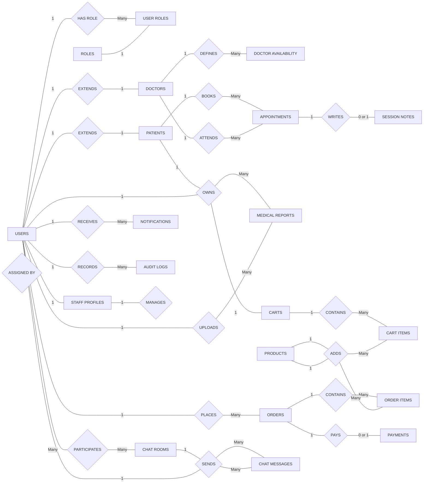

```mermaid
flowchart LR

    %% =========================
    %% ENTITIES
    %% =========================

    USERS[USERS]

    ROLES[ROLES]

    USERROLES[USER ROLES]

    STAFF[STAFF PROFILES]

    PATIENTS[PATIENTS]

    DOCTORS[DOCTORS]

    AVAILABILITY[DOCTOR AVAILABILITY]

    APPOINTMENTS[APPOINTMENTS]

    SESSIONNOTES[SESSION NOTES]

    MEDICALREPORTS[MEDICAL REPORTS]

    PRODUCTS[PRODUCTS]

    CARTS[CARTS]

    CARTITEMS[CART ITEMS]

    ORDERS[ORDERS]

    ORDERITEMS[ORDER ITEMS]

    PAYMENTS[PAYMENTS]

    CHATROOMS[CHAT ROOMS]

    CHATMESSAGES[CHAT MESSAGES]

    NOTIFICATIONS[NOTIFICATIONS]

    AUDITLOGS[AUDIT LOGS]


    %% =========================
    %% RELATIONSHIPS
    %% =========================

    EXTENDS1{EXTENDS}
    EXTENDS2{EXTENDS}
    HASROLE{HAS ROLE}
    ASSIGNED{ASSIGNED BY}

    MANAGES{MANAGES}
    
    DEFINES{DEFINES}

    BOOKS{BOOKS}

    ATTENDS{ATTENDS}

    WRITES{WRITES}

    OWNS{OWNS}

    UPLOADS{UPLOADS}

    ADDS{ADDS}

    CONTAINS1{CONTAINS}

    CONTAINS2{CONTAINS}

    PLACES{PLACES}

    PAYS{PAYS}

    PARTICIPATES{PARTICIPATES}

    SENDS{SENDS}

    RECEIVES{RECEIVES}

    RECORDS{RECORDS}


    %% =========================
    %% USER MANAGEMENT
    %% =========================

    USERS -- "1" --- EXTENDS1
    EXTENDS1 -- "1" --- PATIENTS


    USERS -- "1" --- EXTENDS2
    EXTENDS2 -- "1" --- DOCTORS


    USERS -- "1" --- HASROLE
    HASROLE -- "Many" --- USERROLES


    ROLES -- "1" --- USERROLES


    USERS -- "1" --- STAFF
    STAFF -- "1" --- MANAGES


    %% =========================
    %% DOCTOR / PATIENT MODULE
    %% =========================

    DOCTORS -- "1" --- DEFINES
    DEFINES -- "Many" --- AVAILABILITY


    PATIENTS -- "1" --- BOOKS
    BOOKS -- "Many" --- APPOINTMENTS


    DOCTORS -- "1" --- ATTENDS
    ATTENDS -- "Many" --- APPOINTMENTS


    APPOINTMENTS -- "1" --- WRITES
    WRITES -- "0 or 1" --- SESSIONNOTES


    PATIENTS -- "1" --- OWNS
    OWNS -- "Many" --- MEDICALREPORTS


    USERS -- "1" --- UPLOADS
    UPLOADS -- "Many" --- MEDICALREPORTS


    %% =========================
    %% E-COMMERCE MODULE
    %% =========================

    USERS -- "1" --- OWNS
    OWNS -- "1" --- CARTS


    CARTS -- "1" --- CONTAINS1
    CONTAINS1 -- "Many" --- CARTITEMS


    PRODUCTS -- "1" --- ADDS
    ADDS -- "Many" --- CARTITEMS


    USERS -- "1" --- PLACES
    PLACES -- "Many" --- ORDERS


    ORDERS -- "1" --- CONTAINS2
    CONTAINS2 -- "Many" --- ORDERITEMS


    PRODUCTS -- "1" --- ADDS
    ADDS -- "Many" --- ORDERITEMS


    ORDERS -- "1" --- PAYS
    PAYS -- "0 or 1" --- PAYMENTS


    %% =========================
    %% CHAT MODULE
    %% =========================

    USERS -- "Many" --- PARTICIPATES
    PARTICIPATES -- "Many" --- CHATROOMS


    CHATROOMS -- "1" --- SENDS
    SENDS -- "Many" --- CHATMESSAGES


    USERS -- "1" --- SENDS
    SENDS -- "Many" --- CHATMESSAGES


    %% =========================
    %% SYSTEM MODULE
    %% =========================

    USERS -- "1" --- RECEIVES
    RECEIVES -- "Many" --- NOTIFICATIONS


    USERS -- "1" --- RECORDS
    RECORDS -- "Many" --- AUDITLOGS

```