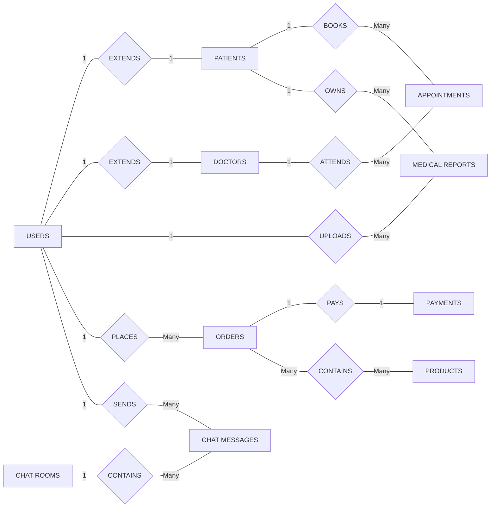

```mermaid
flowchart LR

    %% Entities (Rectangles)
    USERS[USERS]
    PATIENTS[PATIENTS]
    DOCTORS[DOCTORS]
    APPOINTMENTS[APPOINTMENTS]
    MEDICALREPORTS[MEDICAL REPORTS]
    PRODUCTS[PRODUCTS]
    ORDERS[ORDERS]
    PAYMENTS[PAYMENTS]
    CHATROOMS[CHAT ROOMS]
    CHATMESSAGES[CHAT MESSAGES]

    %% Relationships (Diamonds)
    EXTENDS1{EXTENDS}
    EXTENDS2{EXTENDS}
    BOOKS{BOOKS}
    OWNS{OWNS}
    ATTENDS{ATTENDS}
    UPLOADS{UPLOADS}
    PLACES{PLACES}
    PAYS{PAYS}
    CONTAINS1{CONTAINS}
    CONTAINS2{CONTAINS}
    SENDS{SENDS}

    %% Relationships with Cardinality

    USERS -- "1" --- EXTENDS1
    EXTENDS1 -- "1" --- PATIENTS

    USERS -- "1" --- EXTENDS2
    EXTENDS2 -- "1" --- DOCTORS

    PATIENTS -- "1" --- BOOKS
    BOOKS -- "Many" --- APPOINTMENTS

    DOCTORS -- "1" --- ATTENDS
    ATTENDS -- "Many" --- APPOINTMENTS

    PATIENTS -- "1" --- OWNS
    OWNS -- "Many" --- MEDICALREPORTS

    USERS -- "1" --- UPLOADS
    UPLOADS -- "Many" --- MEDICALREPORTS

    USERS -- "1" --- PLACES
    PLACES -- "Many" --- ORDERS

    ORDERS -- "1" --- PAYS
    PAYS -- "1" --- PAYMENTS

    ORDERS -- "Many" --- CONTAINS1
    CONTAINS1 -- "Many" --- PRODUCTS

    USERS -- "1" --- SENDS
    SENDS -- "Many" --- CHATMESSAGES

    CHATROOMS -- "1" --- CONTAINS2
    CONTAINS2 -- "Many" --- CHATMESSAGES


```