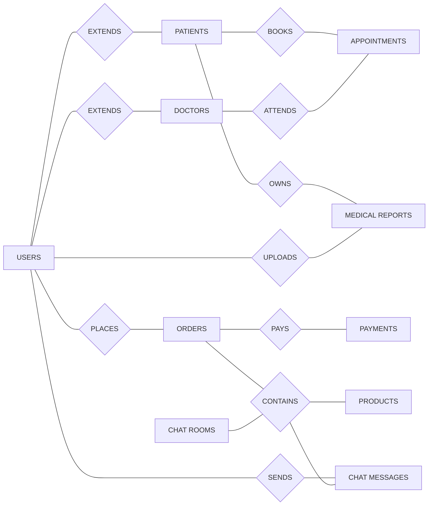

```mermaid
flowchart LR

    %% Entities (Rectangles)
    USERS[USERS]
    PATIENTS[PATIENTS]
    DOCTORS[DOCTORS]
    APPOINTMENTS[APPOINTMENTS]
    MEDICALREPORTS[MEDICAL REPORTS]
    PRODUCTS[PRODUCTS]
    ORDERS[ORDERS]
    PAYMENTS[PAYMENTS]
    CHATROOMS[CHAT ROOMS]
    CHATMESSAGES[CHAT MESSAGES]


    %% Relationships (Diamonds)
    EXTENDS1{EXTENDS}
    EXTENDS2{EXTENDS}
    BOOKS{BOOKS}
    OWNS{OWNS}
    ATTENDS{ATTENDS}
    UPLOADS{UPLOADS}
    PLACES{PLACES}
    PAYS{PAYS}
    CONTAINS{CONTAINS}
    SENDS{SENDS}


    %% Relationships
    USERS --- EXTENDS1
    EXTENDS1 --- PATIENTS

    USERS --- EXTENDS2
    EXTENDS2 --- DOCTORS


    PATIENTS --- BOOKS
    BOOKS --- APPOINTMENTS

    DOCTORS --- ATTENDS
    ATTENDS --- APPOINTMENTS


    PATIENTS --- OWNS
    OWNS --- MEDICALREPORTS

    USERS --- UPLOADS
    UPLOADS --- MEDICALREPORTS


    USERS --- PLACES
    PLACES --- ORDERS


    ORDERS --- PAYS
    PAYS --- PAYMENTS


    ORDERS --- CONTAINS
    CONTAINS --- PRODUCTS


    USERS --- SENDS
    SENDS --- CHATMESSAGES

    CHATROOMS --- CONTAINS
    CONTAINS --- CHATMESSAGES
    
```