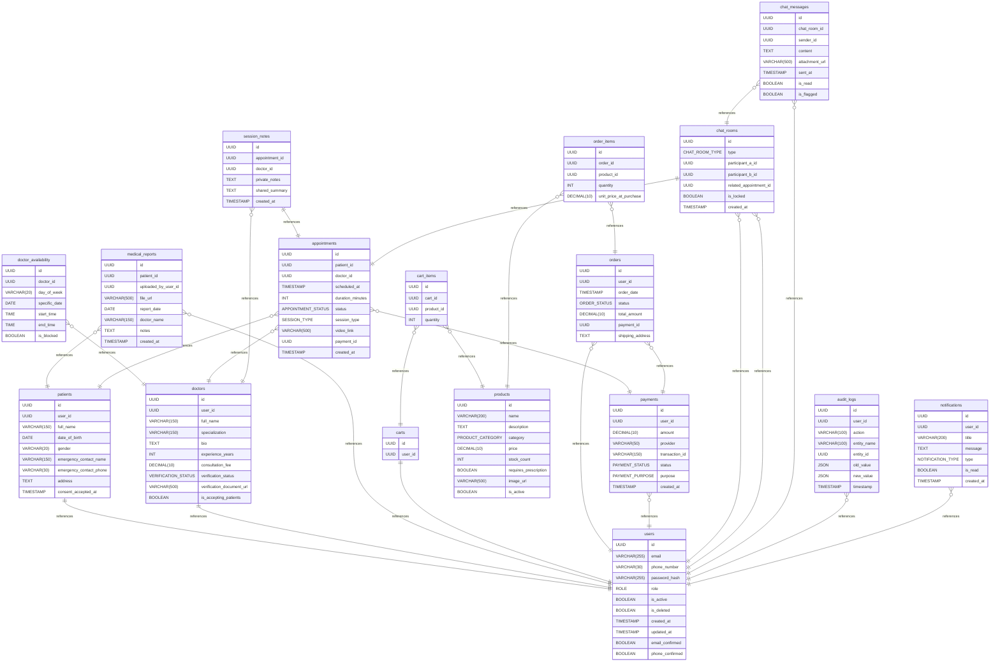

```mermaid
erDiagram
	patients ||--|| users : references
	doctors ||--|| users : references
	medical_reports }o--|| patients : references
	medical_reports }o--|| users : references
	doctor_availability }o--|| doctors : references
	appointments }o--|| patients : references
	appointments }o--|| doctors : references
	appointments }o--|| payments : references
	session_notes ||--|| appointments : references
	session_notes }o--|| doctors : references
	carts ||--|| users : references
	cart_items }o--|| carts : references
	cart_items }o--|| products : references
	orders }o--|| users : references
	orders }o--|| payments : references
	order_items }o--|| orders : references
	order_items }o--|| products : references
	payments }o--|| users : references
	chat_rooms }o--|| users : references
	chat_rooms }o--|| users : references
	chat_rooms ||--|| appointments : references
	chat_messages }o--|| chat_rooms : references
	chat_messages }o--|| users : references
	audit_logs }o--|| users : references
	notifications }o--|| users : references

	users {
		UUID id
		VARCHAR(255) email
		VARCHAR(30) phone_number
		VARCHAR(255) password_hash
		ROLE role
		BOOLEAN is_active
		BOOLEAN is_deleted
		TIMESTAMP created_at
		TIMESTAMP updated_at
		BOOLEAN email_confirmed
		BOOLEAN phone_confirmed
	}

	patients {
		UUID id
		UUID user_id
		VARCHAR(150) full_name
		DATE date_of_birth
		VARCHAR(20) gender
		VARCHAR(150) emergency_contact_name
		VARCHAR(30) emergency_contact_phone
		TEXT address
		TIMESTAMP consent_accepted_at
	}

	doctors {
		UUID id
		UUID user_id
		VARCHAR(150) full_name
		VARCHAR(150) specialization
		TEXT bio
		INT experience_years
		DECIMAL(10) consultation_fee
		VERIFICATION_STATUS verification_status
		VARCHAR(500) verification_document_url
		BOOLEAN is_accepting_patients
	}

	medical_reports {
		UUID id
		UUID patient_id
		UUID uploaded_by_user_id
		VARCHAR(500) file_url
		DATE report_date
		VARCHAR(150) doctor_name
		TEXT notes
		TIMESTAMP created_at
	}

	doctor_availability {
		UUID id
		UUID doctor_id
		VARCHAR(20) day_of_week
		DATE specific_date
		TIME start_time
		TIME end_time
		BOOLEAN is_blocked
	}

	appointments {
		UUID id
		UUID patient_id
		UUID doctor_id
		TIMESTAMP scheduled_at
		INT duration_minutes
		APPOINTMENT_STATUS status
		SESSION_TYPE session_type
		VARCHAR(500) video_link
		UUID payment_id
		TIMESTAMP created_at
	}

	session_notes {
		UUID id
		UUID appointment_id
		UUID doctor_id
		TEXT private_notes
		TEXT shared_summary
		TIMESTAMP created_at
	}

	products {
		UUID id
		VARCHAR(200) name
		TEXT description
		PRODUCT_CATEGORY category
		DECIMAL(10) price
		INT stock_count
		BOOLEAN requires_prescription
		VARCHAR(500) image_url
		BOOLEAN is_active
	}

	carts {
		UUID id
		UUID user_id
	}

	cart_items {
		UUID id
		UUID cart_id
		UUID product_id
		INT quantity
	}

	orders {
		UUID id
		UUID user_id
		TIMESTAMP order_date
		ORDER_STATUS status
		DECIMAL(10) total_amount
		UUID payment_id
		TEXT shipping_address
	}

	order_items {
		UUID id
		UUID order_id
		UUID product_id
		INT quantity
		DECIMAL(10) unit_price_at_purchase
	}

	payments {
		UUID id
		UUID user_id
		DECIMAL(10) amount
		VARCHAR(50) provider
		VARCHAR(150) transaction_id
		PAYMENT_STATUS status
		PAYMENT_PURPOSE purpose
		TIMESTAMP created_at
	}

	chat_rooms {
		UUID id
		CHAT_ROOM_TYPE type
		UUID participant_a_id
		UUID participant_b_id
		UUID related_appointment_id
		BOOLEAN is_locked
		TIMESTAMP created_at
	}

	chat_messages {
		UUID id
		UUID chat_room_id
		UUID sender_id
		TEXT content
		VARCHAR(500) attachment_url
		TIMESTAMP sent_at
		BOOLEAN is_read
		BOOLEAN is_flagged
	}

	audit_logs {
		UUID id
		UUID user_id
		VARCHAR(100) action
		VARCHAR(100) entity_name
		UUID entity_id
		JSON old_value
		JSON new_value
		TIMESTAMP timestamp
	}

	notifications {
		UUID id
		UUID user_id
		VARCHAR(200) title
		TEXT message
		NOTIFICATION_TYPE type
		BOOLEAN is_read
		TIMESTAMP created_at
	}

```