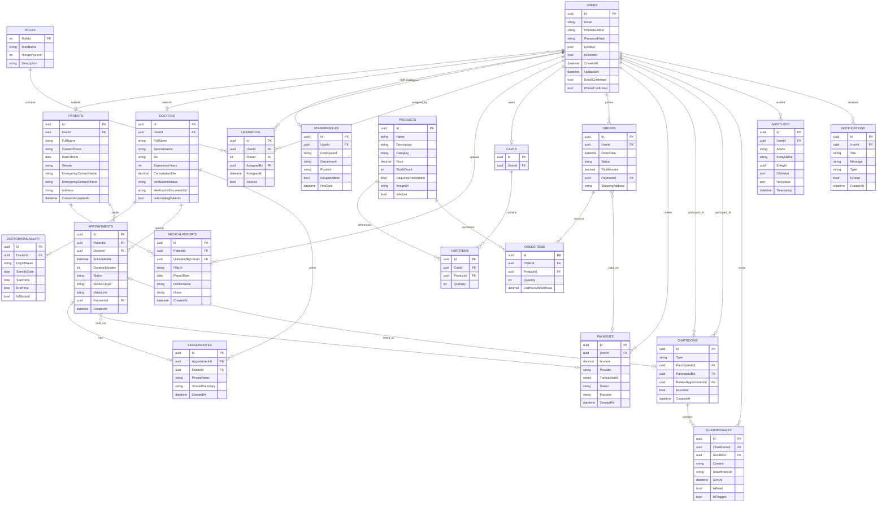

# Sunshine Mental Health Counciling and Therapy Platform - Database ER Diagram

```mermaid
erDiagram

    USERS {
        uuid Id PK
        string Email
        string PhoneNumber
        string PasswordHash
        bool IsActive
        bool IsDeleted
        datetime CreatedAt
        datetime UpdatedAt
        bool EmailConfirmed
        bool PhoneConfirmed
    }

    ROLES {
        int RoleId PK
        string RoleName
        int HierarchyLevel
        string Description
    }

    USERROLES {
        uuid Id PK
        uuid UserId FK
        int RoleId FK
        uuid AssignedBy FK
        datetime AssignedAt
        bool IsActive
    }

    STAFFPROFILES {
        uuid Id PK
        uuid UserId FK
        string EmployeeId
        string Department
        string Position
        bool IsSuperAdmin
        datetime HireDate
    }

    PATIENTS {
        uuid Id PK
        uuid UserId FK
        string FullName
        string ContactPhone
        date DateOfBirth
        string Gender
        string EmergencyContactName
        string EmergencyContactPhone
        string Address
        datetime ConsentAcceptedAt
    }

    DOCTORS {
        uuid Id PK
        uuid UserId FK
        string FullName
        string Specialization
        string Bio
        int ExperienceYears
        decimal ConsultationFee
        string VerificationStatus
        string VerificationDocumentUrl
        bool IsAcceptingPatients
    }

    MEDICALREPORTS {
        uuid Id PK
        uuid PatientId FK
        uuid UploadedByUserId FK
        string FileUrl
        date ReportDate
        string DoctorName
        string Notes
        datetime CreatedAt
    }

    DOCTORAVAILABILITY {
        uuid Id PK
        uuid DoctorId FK
        string DayOfWeek
        date SpecificDate
        time StartTime
        time EndTime
        bool IsBlocked
    }

    APPOINTMENTS {
        uuid Id PK
        uuid PatientId FK
        uuid DoctorId FK
        datetime ScheduledAt
        int DurationMinutes
        string Status
        string SessionType
        string VideoLink
        uuid PaymentId FK
        datetime CreatedAt
    }

    SESSIONNOTES {
        uuid Id PK
        uuid AppointmentId FK
        uuid DoctorId FK
        string PrivateNotes
        string SharedSummary
        datetime CreatedAt
    }

    PRODUCTS {
        uuid Id PK
        string Name
        string Description
        string Category
        decimal Price
        int StockCount
        bool RequiresPrescription
        string ImageUrl
        bool IsActive
    }

    CARTS {
        uuid Id PK
        uuid UserId FK
    }

    CARTITEMS {
        uuid Id PK
        uuid CartId FK
        uuid ProductId FK
        int Quantity
    }

    ORDERS {
        uuid Id PK
        uuid UserId FK
        datetime OrderDate
        string Status
        decimal TotalAmount
        uuid PaymentId FK
        string ShippingAddress
    }

    ORDERITEMS {
        uuid Id PK
        uuid OrderId FK
        uuid ProductId FK
        int Quantity
        decimal UnitPriceAtPurchase
    }

    PAYMENTS {
        uuid Id PK
        uuid UserId FK
        decimal Amount
        string Provider
        string TransactionId
        string Status
        string Purpose
        datetime CreatedAt
    }

    CHATROOMS {
        uuid Id PK
        string Type
        uuid ParticipantAId FK
        uuid ParticipantBId FK
        uuid RelatedAppointmentId FK
        bool IsLocked
        datetime CreatedAt
    }

    CHATMESSAGES {
        uuid Id PK
        uuid ChatRoomId FK
        uuid SenderId FK
        string Content
        string AttachmentUrl
        datetime SentAt
        bool IsRead
        bool IsFlagged
    }

    AUDITLOGS {
        uuid Id PK
        uuid UserId FK
        string Action
        string EntityName
        uuid EntityId
        json OldValue
        json NewValue
        datetime Timestamp
    }

    NOTIFICATIONS {
        uuid Id PK
        uuid UserId FK
        string Title
        string Message
        string Type
        bool IsRead
        datetime CreatedAt
    }

    %% Relationships

    USERS ||--o| PATIENTS : extends
    USERS ||--o| DOCTORS : extends
    USERS ||--o| STAFFPROFILES : staff_profile

    USERS ||--o{ USERROLES : assigned
    ROLES ||--o{ USERROLES : contains
    USERS ||--o{ USERROLES : assigned_by

    USERS ||--o{ MEDICALREPORTS : uploads
    PATIENTS ||--o{ MEDICALREPORTS : owns

    DOCTORS ||--o{ DOCTORAVAILABILITY : defines

    PATIENTS ||--o{ APPOINTMENTS : books
    DOCTORS ||--o{ APPOINTMENTS : attends

    APPOINTMENTS |o--o| SESSIONNOTES : has
    DOCTORS ||--o{ SESSIONNOTES : writes

    APPOINTMENTS }o--o| PAYMENTS : paid_via

    USERS ||--o| CARTS : owns
    CARTS ||--o{ CARTITEMS : contains
    PRODUCTS ||--o{ CARTITEMS : referenced

    USERS ||--o{ ORDERS : places
    ORDERS ||--o{ ORDERITEMS : contains
    PRODUCTS ||--o{ ORDERITEMS : purchased

    ORDERS }o--o| PAYMENTS : paid_via
    USERS ||--o{ PAYMENTS : makes

    USERS ||--o{ CHATROOMS : participant_A
    USERS ||--o{ CHATROOMS : participant_B
    APPOINTMENTS |o--o| CHATROOMS : linked_to

    CHATROOMS ||--o{ CHATMESSAGES : contains
    USERS ||--o{ CHATMESSAGES : sends

    USERS ||--o{ AUDITLOGS : audited
    USERS ||--o{ NOTIFICATIONS : receives
```