# How the Internet Works 🌐

## Simple Definition
> **The Internet is a global network of interconnected computers that communicate with each other using standardized protocols (rules).**

---

## Step 1: 🖥️ You Make a Request

You type `www.google.com` in your browser and hit Enter.

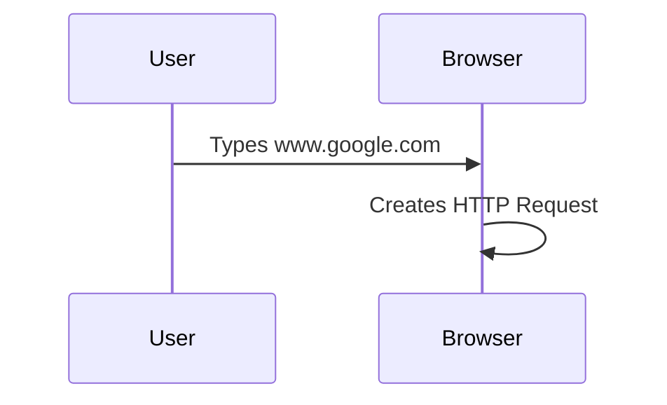

---

## Step 2: 🔤 DNS Lookup (Domain Name System)

Your computer doesn't understand `www.google.com`. It needs an IP address.
**DNS is the "Phone Book" of the Internet.**

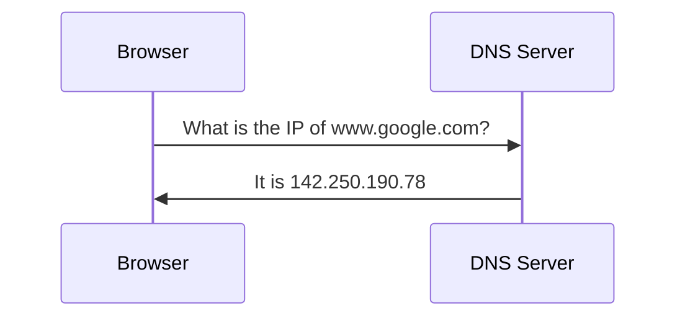

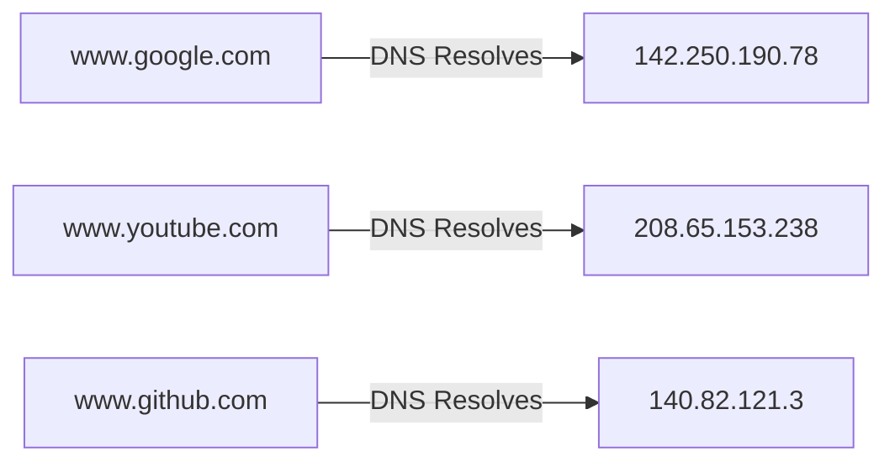

---

## Step 3: 📦 Data is Broken into Packets

Your request is broken into small chunks called **PACKETS**.

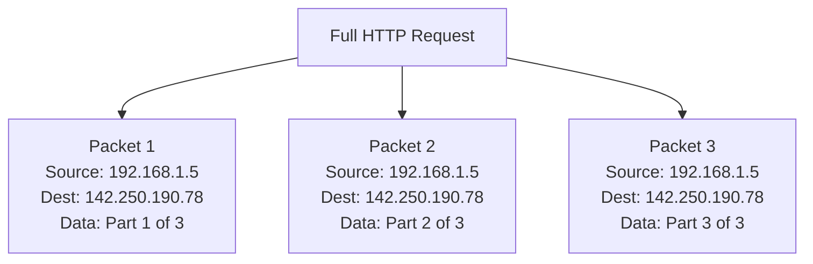

---

## Step 4: 🛣️ Packets Travel Through the Network

Packets may take **DIFFERENT routes** but arrive at the same destination.

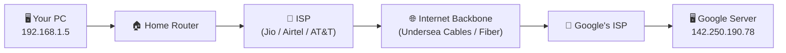

Packets can take **multiple routes**:

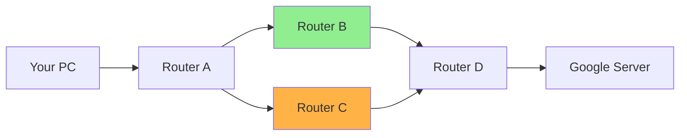

> **Note:** Routers decide the best path. If one route is busy, packets go through another.

---

## Step 5: 📡 Protocols Handle Communication

### TCP/IP Model

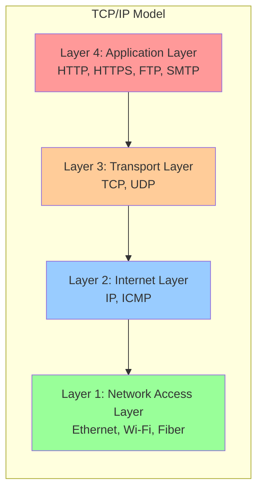

### What Each Protocol Does

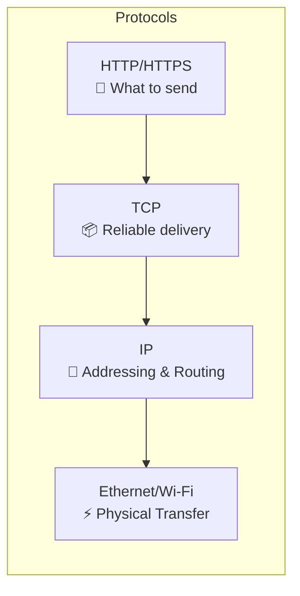

---

## Step 6: ✅ Server Responds

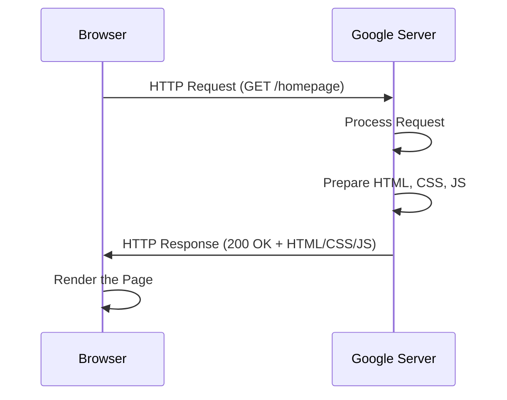

---

## Step 7: 🖥️ Browser Renders the Page

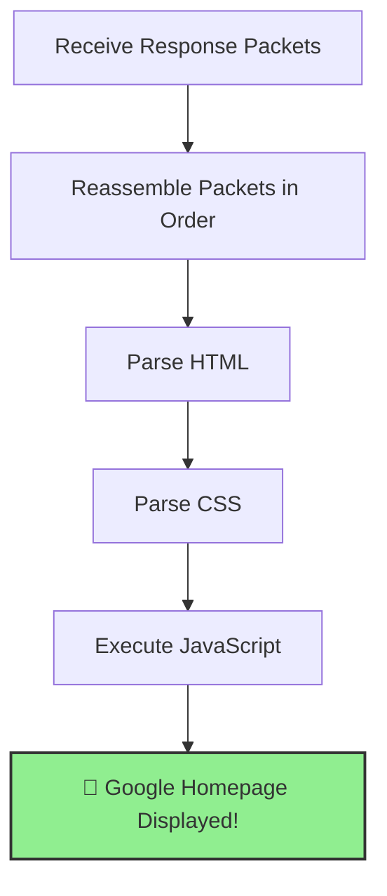

---

## 🔄 Complete End-to-End Flow

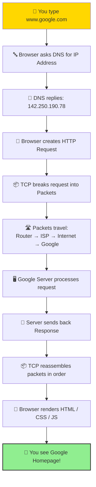

---

## 🔑 Key Components

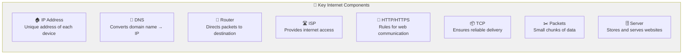

---

## 📝 Important Notes

### Note 1: Client-Server Model

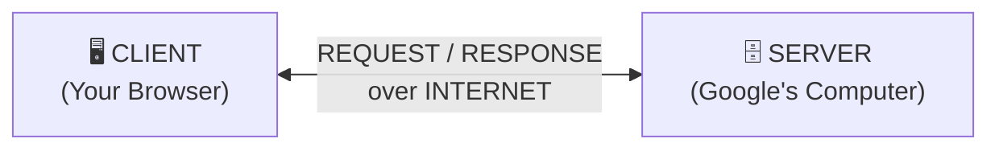

### Note 2: HTTP vs HTTPS

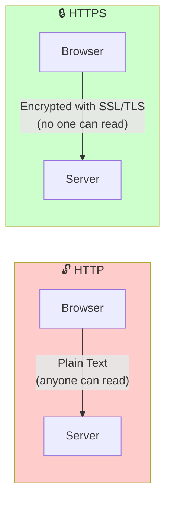

### Note 3: How Data Physically Travels

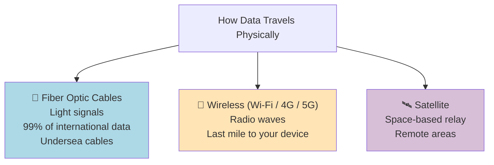

### Note 4: IP Address Types

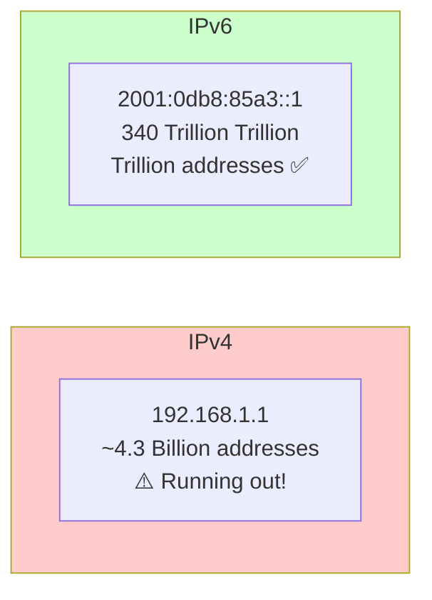

### Note 5: What ISP Does

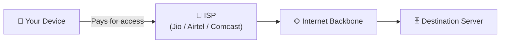

### Note 6: DNS Hierarchy

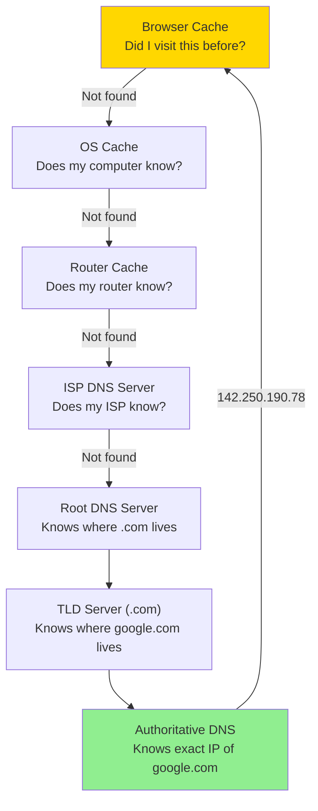

### Note 7: TCP vs UDP

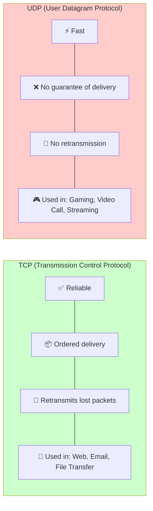

### Note 8: Three-Way Handshake (TCP Connection)

Before any data is sent, TCP establishes connection:

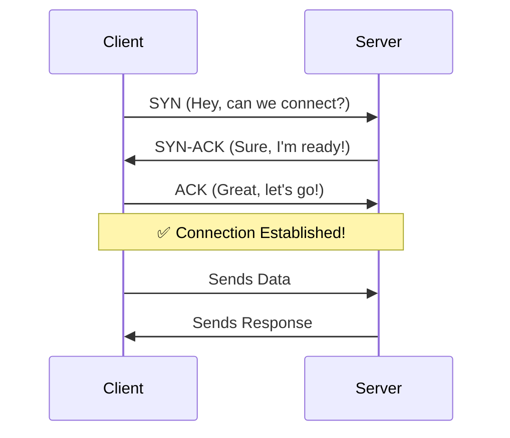

---

## 🧠 One-Liner to Remember

> *"The Internet is just computers talking to other computers using agreed-upon rules (protocols), sending data in small packets through a network of routers."*

