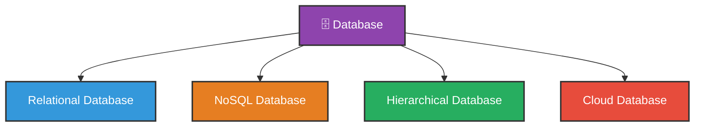
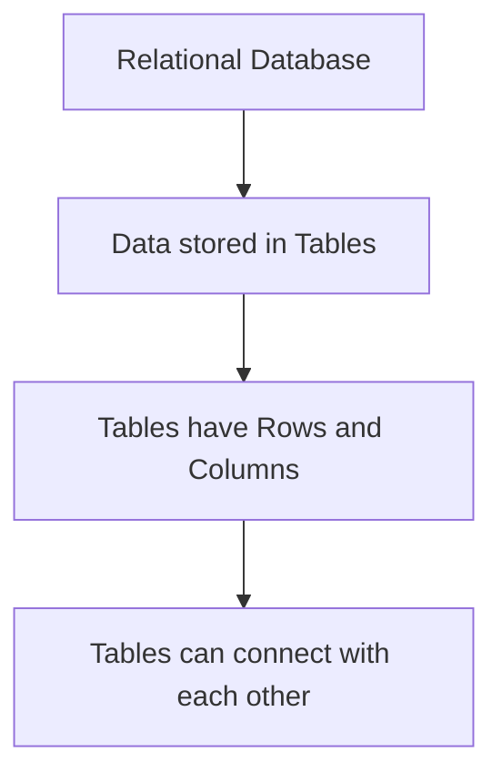
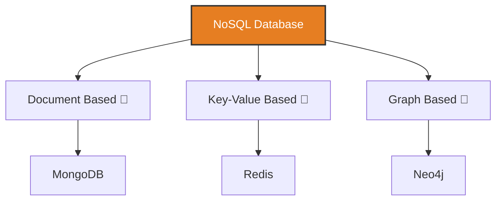
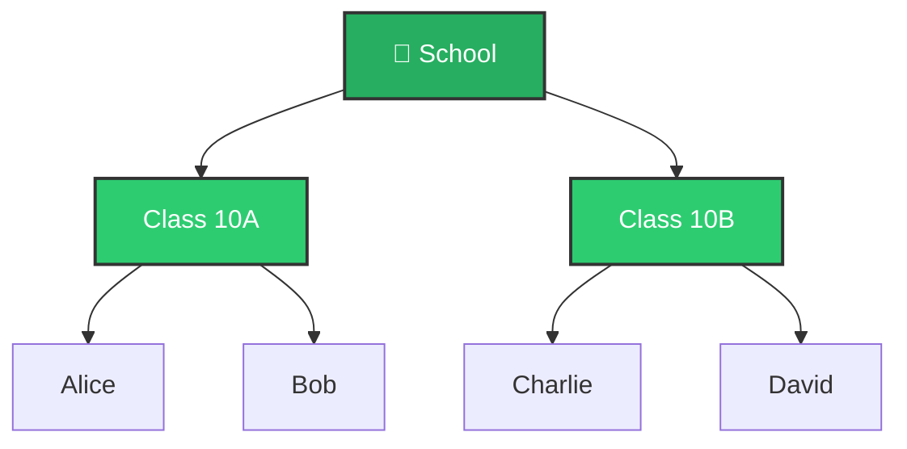
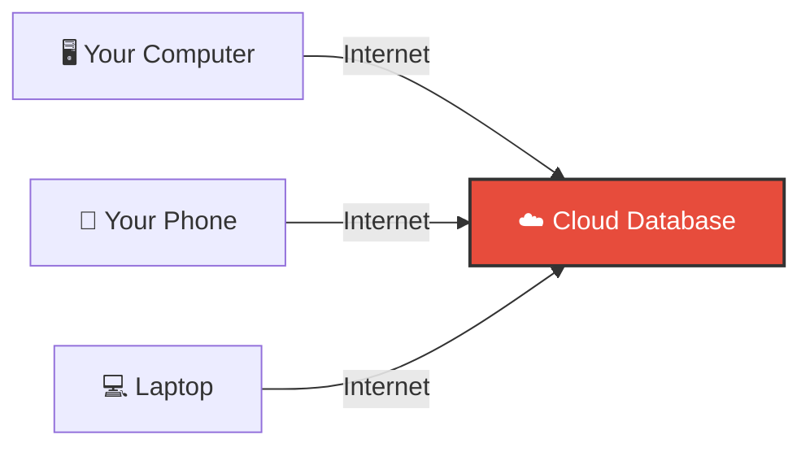
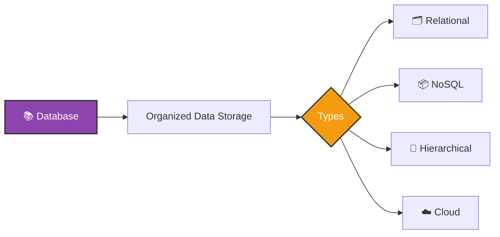

# Introduction to Database

## What is a Database?

A **database** is a structured collection of data that is stored and managed in a way that allows for easy access, retrieval, and manipulation. It serves as a central repository for information, enabling users to efficiently store, organize, and retrieve data as needed.

### Real Life Examples

| Real Life | Database Equivalent |
|---|---|
| 📓 Phone book | Contact Database |
| 📚 Library catalog | Book Database |
| 🏥 Hospital records | Patient Database |
| 🛒 Online shopping cart | Product Database |

---

## Why Do We Need a Database?

Without a database, imagine storing **thousands of student records** in a simple text file or paper. It would be:

- ❌ Hard to search
- ❌ Easy to lose data
- ❌ Difficult to update
- ❌ Time consuming

With a database it becomes:

- ✅ Easy to search
- ✅ Data is safe and secure
- ✅ Easy to update
- ✅ Fast and efficient

---

## Types of Databases



---

### 1. 🗂️ Relational Database

Think of this like an **Excel spreadsheet** — data is stored in **rows** and **columns** inside a table.



**Example — A simple Student Table:**

| StudentID | Name    | Age | Grade |
|-----------|---------|-----|-------|
| 1         | Alice   | 14  | A     |
| 2         | Bob     | 15  | B     |
| 3         | Charlie | 14  | A     |

> 💡 **Popular Examples:** MySQL, PostgreSQL

---

### 2. 📦 NoSQL Database

**NoSQL** means **Not Only SQL**. Instead of tables, data is stored in a more **flexible format** — like a JSON file or a simple document.



**Example — Same Student data in NoSQL:**

```json
{
  "StudentID": 1,
  "Name": "Alice",
  "Age": 14,
  "Grade": "A"
}
```

> 💡 **Best used when:** Data is large, complex, or changes a lot.

---

### 3. 🌳 Hierarchical Database

Data is organized like a **family tree** — there is a **parent** and **children** under it.



> 💡 Think of it like **folders inside folders** on your computer.

---

### 4. ☁️ Cloud Database

A database that is stored **on the internet** (cloud) instead of your local computer.



> 💡 **Popular Examples:** Google Firebase, Amazon AWS

---

## Quick Comparison

| Type | Stores Data As | Best For | Example |
|---|---|---|---|
| Relational | Tables | Structured data | MySQL |
| NoSQL | Documents/JSON | Flexible data | MongoDB |
| Hierarchical | Tree structure | Organized hierarchy | File Systems |
| Cloud | Online storage | Anywhere access | Firebase |

---

## Summary



> **In Simple Words** — A database is just a smart way to **store and organize information** so you can find and use it easily whenever you need it! 🎯