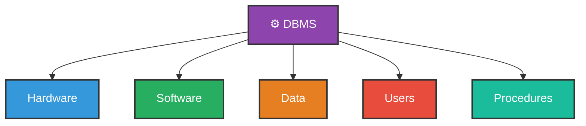
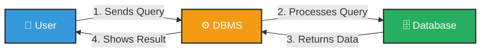

# DBMS — Database Management System

---

## What is DBMS?

**DBMS** stands for **Database Management System**.

It is a **software** that allows users to **create**, **store**, **manage**, and **retrieve** data from a database in an organized way.

It acts as a **middle layer** between the **user** and the **database**.

> **Examples of DBMS:** MySQL, Oracle, PostgreSQL, MongoDB, Microsoft Access

---

## Why DBMS?

Before DBMS, data was stored in **flat files** (normal `.txt` or `.csv` files). This caused many problems:

| Problem in Flat Files | How DBMS Solves It |
|---|---|
| Same data stored multiple times **(Redundancy)** | Stores data only once |
| No control over who accesses data **(No Security)** | Provides user authentication and access control |
| Very slow searching in large data | Provides fast querying using SQL |
| Data could be lost easily | Provides backup and recovery |
| Only one person could use it at a time | Supports multiple users simultaneously |

---

## Components of DBMS



### 1. Hardware
The **physical devices** used to store and run the database.
> Example: Hard disk, RAM, Server machine

### 2. Software
The actual **DBMS program** that manages the database.
> Example: MySQL software installed on a computer

### 3. Data
The actual **information** stored inside the database.
> Example: Student names, marks, attendance records

### 4. Users
The people who **interact** with the DBMS.

| User Type | Role |
|---|---|
| **End User** | Uses the application to view/enter data |
| **Application Developer** | Builds apps that use the database |
| **Database Administrator (DBA)** | Manages and maintains the database |

### 5. Procedures
The **rules and instructions** on how to use and manage the database.
> Example: Backup rules, access control policies, data entry rules

---

## How DBMS Works



### Step by Step

**Step 1 — User Sends a Query**
The user types a request (query) to get some data.
```sql
SELECT * FROM Students WHERE Grade = 'A';
```

**Step 2 — DBMS Processes the Query**
DBMS reads the query, checks if it is valid, and figures out how to get the data.

**Step 3 — Data is Fetched from Database**
DBMS goes into the database and finds the matching records.

**Step 4 — Result is Shown to the User**
DBMS sends back the result and displays it to the user.

| StudentID | Name    | Grade |
|-----------|---------|-------|
| 1         | Alice   | A     |
| 3         | Charlie | A     |

---

## Functions of DBMS

| Function | Description | Example |
|---|---|---|
| **Data Definition** | Create and modify database structure | Creating a Student table |
| **Data Storage** | Stores data in an organized way | Saving student records |
| **Data Retrieval** | Fetches data on user request | Searching a student by name |
| **Data Update** | Insert, update, delete records | Changing a student's grade |
| **Data Security** | Controls who can access what | Only admin can delete records |
| **Backup & Recovery** | Saves a copy and restores if needed | Recovering lost data after crash |
| **Concurrency Control** | Many users can work at the same time | Teacher and admin both accessing records |

---

## Advantages of DBMS

- ✅ Removes data **redundancy** (no repeated data)
- ✅ Improves data **security** and privacy
- ✅ Easy **data sharing** among multiple users
- ✅ **Backup and recovery** keeps data safe
- ✅ Data remains **consistent** and accurate

## Disadvantages of DBMS

- ❌ **Expensive** to set up (software, hardware, staff)
- ❌ **Complex** to install and manage
- ❌ Requires **trained staff** (like a Database Administrator)
- ❌ **Hardware failure** can still cause data loss

---

## Summary

| Point | Detail |
|---|---|
| **Full Form** | Database Management System |
| **Purpose** | Create, store, manage and retrieve data |
| **Components** | Hardware, Software, Data, Users, Procedures |
| **Examples** | MySQL, Oracle, MongoDB, PostgreSQL |
| **Key Benefit** | Organized, secure, efficient data management |