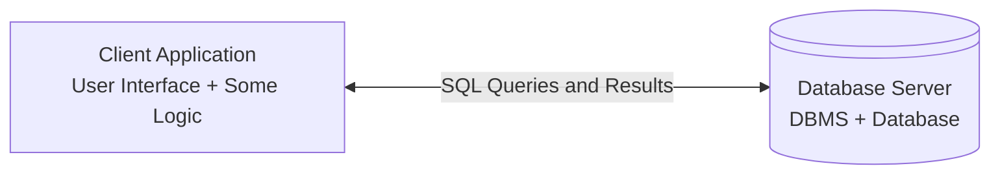
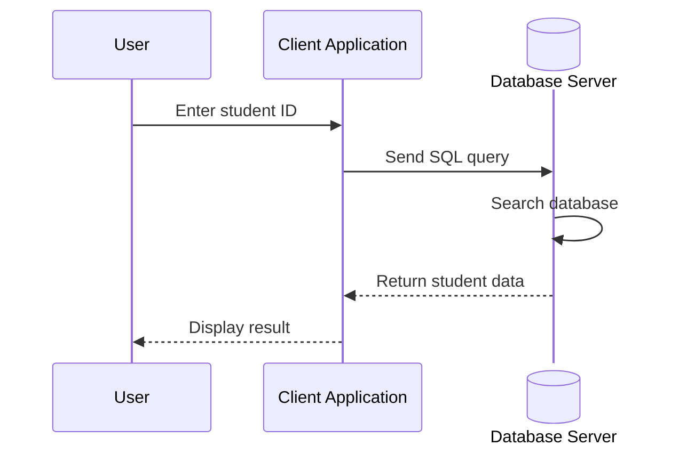
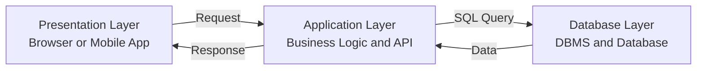
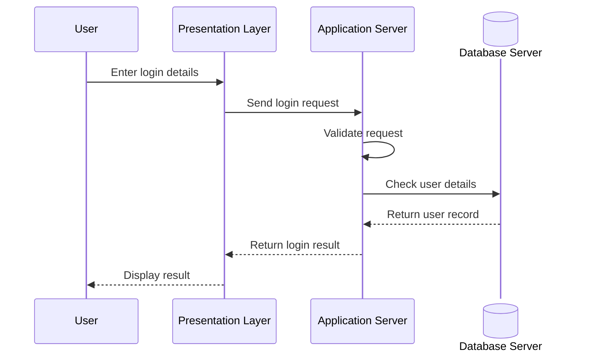
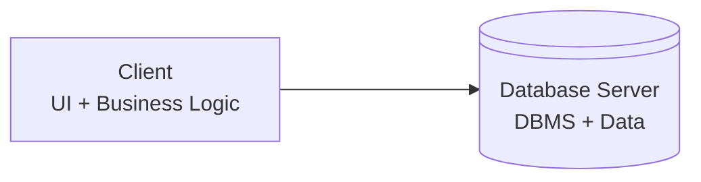
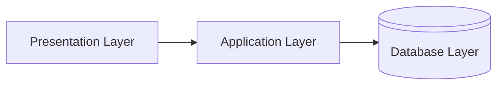
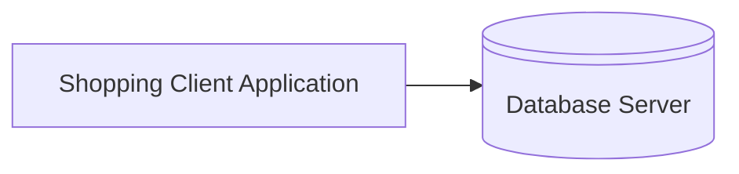
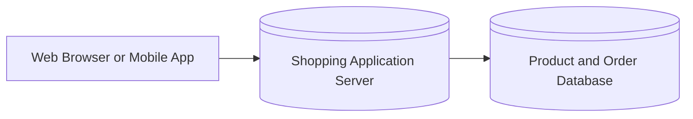

# 2-Tier and 3-Tier Architecture

In database applications, **architecture** describes how the client, application logic, and database communicate with each other.

---

# 1. 2-Tier Architecture

## Definition

**2-tier architecture** is a client-server architecture in which the client application communicates **directly** with the database server.

It has two main layers:

1. **Client Layer**
2. **Database Server Layer**

The client usually contains the user interface and some business logic.

## Simple Diagram



## Components

### 1. Client

The client is the application used by the user.

It may contain:

- User interface
- Input validation
- Some business rules
- SQL queries

**Examples:**

- Desktop banking application
- School management desktop software
- Microsoft Access application

### 2. Database Server

The database server:

- Runs the DBMS
- Stores the database
- Processes SQL queries
- Sends results to the client

**Examples:**

- MySQL Server
- PostgreSQL Server
- Oracle Database Server

## How 2-Tier Architecture Works



### Example

A school desktop application sends this query directly to the database server:

```sql
SELECT * FROM Students
WHERE StudentID = 101;
```

The database server processes the query and returns the student's information to the client application.

## Advantages of 2-Tier Architecture

- Simple to design and understand
- Easy to develop for small applications
- Fast communication between client and database
- Suitable for small networks
- Lower initial development cost

## Disadvantages of 2-Tier Architecture

- Client directly accesses the database
- Database security can be difficult
- Business logic may be repeated in multiple clients
- Difficult to update many client applications
- Not suitable for a large number of users
- Requires database connection on every client

## Example

```text
Desktop Application  →  MySQL Database Server
```

---

# 2. 3-Tier Architecture

## Definition

**3-tier architecture** divides an application into three separate layers:

1. **Presentation Layer**
2. **Application Layer**
3. **Database Layer**

The client does not communicate directly with the database. It communicates with the application server.

## Simple Diagram



## Components

### 1. Presentation Layer

This is the part that the user sees and interacts with.

It includes:

- Web pages
- Forms
- Buttons
- Mobile app screens
- User input fields

**Examples:**

- Web browser
- Android application
- React or Angular frontend

### 2. Application Layer

This layer contains the main application logic.

It:

- Receives requests from the client
- Validates user input
- Applies business rules
- Communicates with the database
- Sends responses to the client

**Examples:**

- Node.js server
- Django application
- Spring Boot application
- Laravel application

### 3. Database Layer

This layer stores and manages the data.

It includes:

- Database server
- DBMS
- Tables
- Records
- Stored data

**Examples:**

- MySQL
- PostgreSQL
- Oracle
- SQL Server

## How 3-Tier Architecture Works



### Example

When a user logs in to a website:

1. The user enters a username and password.
2. The browser sends the request to the application server.
3. The application server checks the input.
4. The application server sends a query to the database.
5. The database returns the user record.
6. The application server sends a response to the browser.

The browser never directly connects to the database.

---

# Difference Between 2-Tier and 3-Tier Architecture

| Feature | 2-Tier Architecture | 3-Tier Architecture |
|---|---|---|
| Number of layers | Two | Three |
| Client connection | Directly connects to database | Connects through application server |
| Main layers | Client and database | Presentation, application, and database |
| Business logic | Usually in the client | Stored in the application server |
| Security | Lower because clients access database directly | Higher because database is hidden behind application server |
| Maintenance | More difficult for large systems | Easier to maintain |
| Scalability | Suitable for small applications | Suitable for medium and large applications |
| Performance | Fast for small systems | May have additional communication overhead |
| Example | Desktop application | Online shopping website |

---

# Architecture Comparison Diagrams

## 2-Tier



## 3-Tier



---

# Example: Online Shopping System

## 2-Tier Design



The shopping application directly sends queries to the database.

## 3-Tier Design



The application server handles:

- Login
- Product search
- Shopping cart
- Order processing
- Payment rules

The database server only manages and stores the data.

---

# When to Use Each Architecture?

## Use 2-Tier Architecture When:

- The application is small
- There are few users
- The application is used on a local network
- Fast and simple development is required
- It is a desktop-based system

## Use 3-Tier Architecture When:

- The application has many users
- The system is accessed through the internet
- Better security is required
- The application may grow in the future
- Business logic needs to be managed centrally
- Web or mobile applications are being developed

---

# Summary

- **2-tier architecture** has a direct connection between the client and the database server.
- **3-tier architecture** uses an application server between the client and the database.
- 2-tier architecture is simple and suitable for small applications.
- 3-tier architecture provides better security, maintenance, and scalability.
- Most modern web applications use **3-tier architecture**.