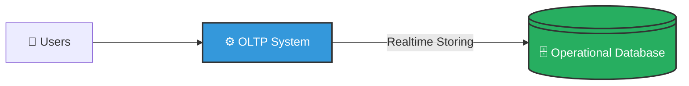
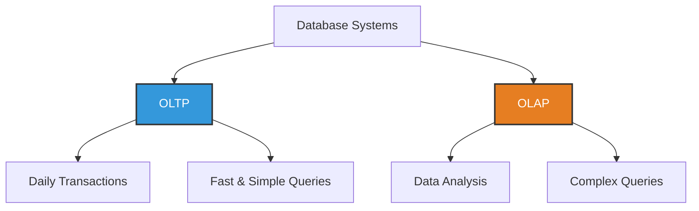

# OLTP and OLAP

---

## 1. OLTP — Online Transaction Processing

### Definition

**OLTP (Online Transaction Processing)** is a system used to manage **day-to-day transactions** in real time.

It is mainly used for **operational work** such as inserting, updating, and deleting records.

---

### Characteristics of OLTP

| Feature | Description |
|----------|------------|
| Purpose | Handle daily transactions |
| Type of Queries | Simple, short queries |
| Data | Current, detailed data |
| Users | Large number of users |
| Operations | Insert, Update, Delete |
| Speed | Very fast response time |
| Example Databases | MySQL, PostgreSQL, Oracle |

---

### Examples of OLTP Systems

- 🏦 Banking system (money transfer)
- 🛒 Online shopping website
- 🎟️ Railway ticket booking system
- 🏥 Hospital management system

---

### OLTP Example

When you transfer money using online banking:

```sql
UPDATE Accounts 
SET Balance = Balance - 1000 
WHERE AccountID = 101;
```

This is a **transaction**.  
OLTP systems handle thousands of such transactions every second.

---

### OLTP Diagram



---

## 2. OLAP — Online Analytical Processing

### Definition

**OLAP (Online Analytical Processing)** is used for **data analysis and decision-making**.

It is mainly used to analyze large amounts of historical data.

---

### Characteristics of OLAP

| Feature | Description |
|----------|------------|
| Purpose | Data analysis and reporting |
| Type of Queries | Complex queries |
| Data | Historical, summarized data |
| Users | Fewer users (managers, analysts) |
| Operations | Mostly Read (SELECT) |
| Speed | Slower than OLTP (due to complex queries) |
| Example Tools | Power BI, Tableau, Data Warehouses |

---

### Examples of OLAP Systems

- 📊 Sales analysis reports
- 📈 Business intelligence dashboards
- 🏢 Company performance reports
- 📅 Yearly revenue analysis

---

### OLAP Example

A manager wants to know:

> "What was the total sales in 2025 by region?"

```sql
SELECT Region, SUM(Sales)
FROM Sales_Data
WHERE Year = 2025
GROUP BY Region;
```

This query analyzes large historical data.

---

### OLAP Diagram


---

## Key Difference Between OLTP and OLAP

| Feature | OLTP | OLAP |
|-----------|------|------|
| Full Form | Online Transaction Processing | Online Analytical Processing |
| Purpose | Handle daily operations | Analyze business data |
| Data Type | Current data | Historical data |
| Queries | Simple | Complex |
| Users | Customers, Employees | Managers, Analysts |
| Example | ATM, Online shopping | Business reports |

---

## Simple Comparison Diagram



---

## Summary

- **OLTP** → Used for performing daily business transactions.  
- **OLAP** → Used for analyzing data and making business decisions.  

> ✅ OLTP = Running the business  
> ✅ OLAP = Analyzing the business