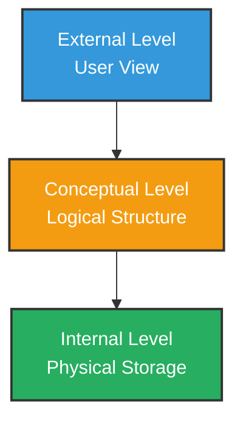
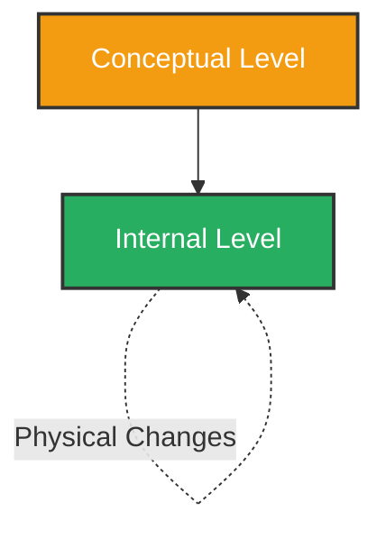
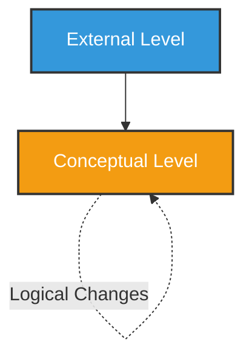

# Data Independence

## Definition

**Data Independence** is the ability to modify the structure of the database **without affecting the application programs** that use it.

In simple words:

> Changes in the database structure should not require changes in the application.

---

## Why Data Independence is Important?

If every small change in the database required changes in all programs, it would:

- Increase maintenance cost
- Increase development time
- Create errors in applications
- Make the system difficult to manage

Data independence makes the system flexible and easier to maintain.

---

## Three-Level Architecture (ANSI-SPARC Model)

Data independence is based on the **three-level architecture** of DBMS.

### 1. External Level (View Level)
- What the user sees.
- Different users can have different views.

Example:  
A teacher sees student marks.  
An accountant sees student fee details.

---

### 2. Conceptual Level (Logical Level)
- Overall logical structure of the database.
- Defines tables, relationships, constraints.

Example:
- Student table
- Course table
- Relationship between student and course

---

### 3. Internal Level (Physical Level)
- How data is physically stored.
- Includes file structure, indexing, storage methods.

Example:
- Data stored in hard disk
- B-Tree indexing used

---

# Types of Data Independence

There are **two types** of data independence:

---

## 1. Physical Data Independence

### Definition

Ability to change the **internal level (physical storage)** without affecting the conceptual level.

In simple words:

> Changes in storage details should not affect the logical structure.

### Examples

- Changing file organization
- Adding or removing indexes
- Moving data to a new storage device
- Changing storage format

### Diagram

### Example Explanation

Suppose we add an **index** to improve search speed.

- Database structure remains the same.
- Application programs do not change.
- Only performance improves.

This is physical data independence.

---

## 2. Logical Data Independence

### Definition

Ability to change the **conceptual level (logical structure)** without affecting the external level (user views).

In simple words:

> Changes in table structure should not affect user views or applications.

### Examples

- Adding a new column to a table
- Adding a new table
- Modifying relationships between tables

### Diagram

### Example Explanation

Suppose we add a new column **Email** to the Student table.

- Old applications that do not use Email continue to work.
- No change required in user interface.
- Database structure is modified logically.

This is logical data independence.

---

# Difference Between Physical and Logical Data Independence

| Feature | Physical Data Independence | Logical Data Independence |
|----------|----------------------------|---------------------------|
| Level Affected | Internal Level | Conceptual Level |
| Difficulty | Easier to achieve | Harder to achieve |
| Example | Adding index | Adding new column |
| Affects Users? | No | No (if properly managed) |

---

# Summary

- **Data Independence** means database changes do not affect application programs.
- It is achieved using the **three-level architecture**.
- There are two types:
  - **Physical Data Independence** — changes in storage.
  - **Logical Data Independence** — changes in database structure.
- Logical data independence is harder to achieve than physical data independence.

✅ Data independence makes the database system flexible, maintainable, and scalable.