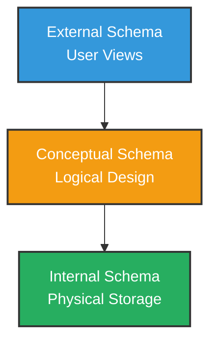
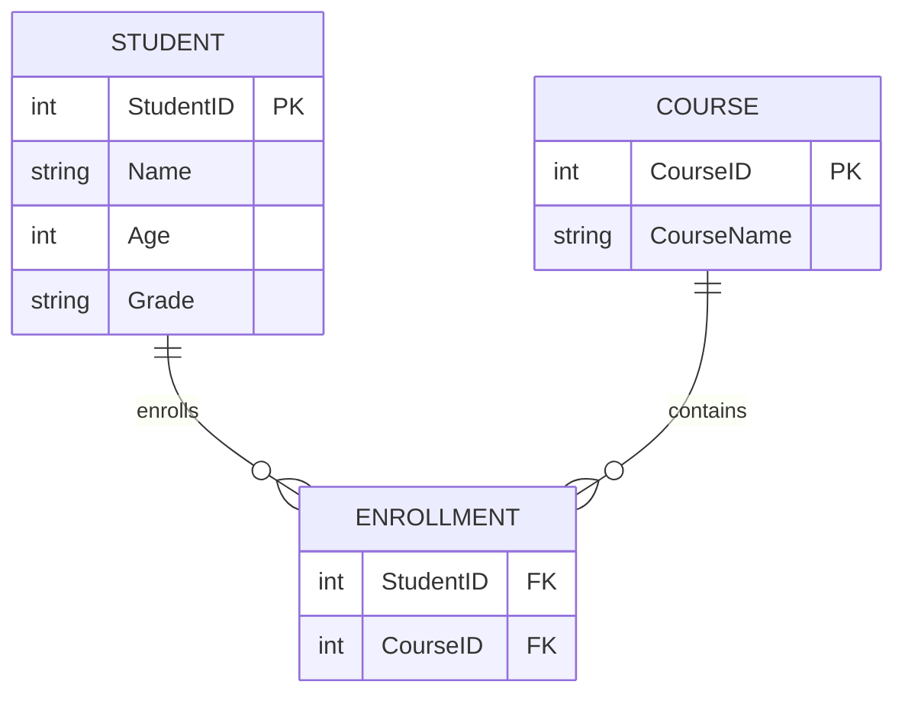
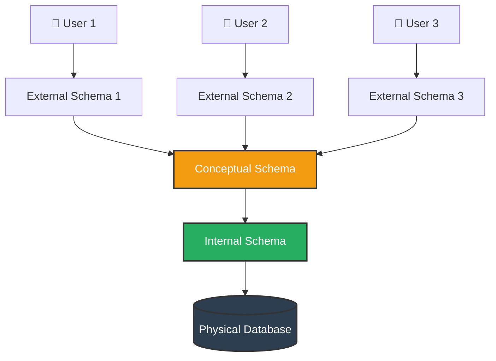

# Schema

## Definition

A **Schema** is the **logical structure or blueprint** of a database.

It defines how data is organized, including:
- Tables
- Columns and their data types
- Relationships between tables
- Constraints and rules

In simple words:

> Schema is the **design** of the database. It tells what data will be stored and how it will be organized.

---

## Real Life Analogy

Think of a schema like a **blueprint of a house**.

- The blueprint shows the structure — rooms, doors, windows.
- The actual furniture and people inside are the **data**.
- The blueprint itself is the **schema**.

---

## Schema vs Data (Instance)

| Schema | Data (Instance) |
|--------|----------------|
| Structure of the database | Actual data stored in the database |
| Defined at the time of database design | Changes frequently |
| Rarely changes | Changes with every insert, update, delete |
| Example: Table name, column names | Example: Actual student records |

### Example

**Schema — Structure of Student Table:**

| Column Name | Data Type | Constraint |
|-------------|-----------|------------|
| StudentID | INT | PRIMARY KEY |
| Name | VARCHAR(50) | NOT NULL |
| Age | INT | - |
| Grade | CHAR(1) | - |

**Instance — Actual Data in Student Table:**

| StudentID | Name | Age | Grade |
|-----------|------|-----|-------|
| 1 | Alice | 20 | A |
| 2 | Bob | 21 | B |

---

## Types of Schema

Based on the **three-level architecture** of DBMS, there are three types of schema:

---

### 1. External Schema (View Level)

- Describes how **individual users** see the data.
- Different users can have different views of the same database.
- Also called **subschema** or **user schema**.

Example:

- A **teacher** sees student names and marks.
- An **accountant** sees student names and fee details.
- Both are looking at the same database but seeing different views.

---

### 2. Conceptual Schema (Logical Level)

- Describes the **overall logical structure** of the entire database.
- Defines all tables, relationships, constraints, and rules.
- There is only **one** conceptual schema for a database.

Example:

---

### 3. Internal Schema (Physical Level)

- Describes how data is **physically stored** on the storage device.
- Includes file structures, indexing methods, and storage formats.
- There is only **one** internal schema for a database.

Example:
- Data stored as B-Tree index on hard disk
- File format used to store records

---

## Summary of Three Schema Types

| Schema Type | Level | Description | Example |
|-------------|-------|-------------|---------|
| **External Schema** | View Level | User specific views | Teacher sees marks only |
| **Conceptual Schema** | Logical Level | Overall structure of database | Tables and relationships |
| **Internal Schema** | Physical Level | How data is stored on disk | File structure, indexing |

---

## Schema Diagram (Complete Overview)

---

## Summary

- A **Schema** is the structure or blueprint of a database.
- It defines tables, columns, data types, relationships, and constraints.
- It does not contain actual data, only the structure.
- There are three types of schema based on the three-level architecture:
  - **External Schema** — User level view
  - **Conceptual Schema** — Overall logical structure
  - **Internal Schema** — Physical storage structure