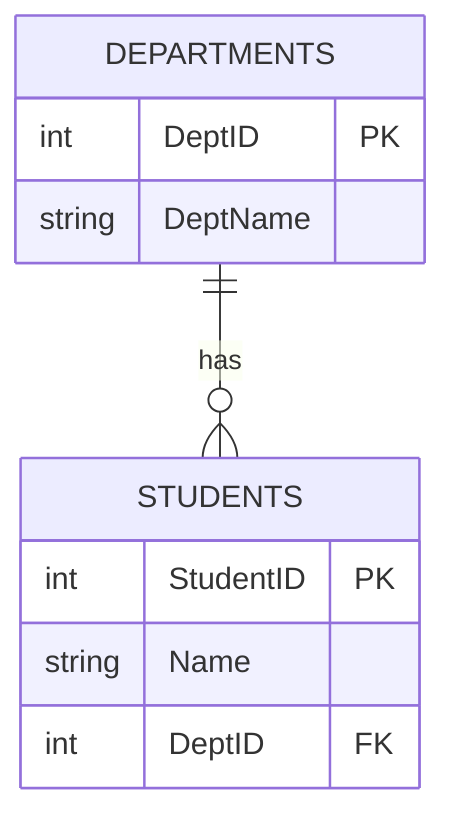

# Constraints in Database

## Definition

**Constraints** are rules applied on the data in a database to ensure **accuracy**, **consistency**, and **integrity** of the data.

In simple words:

> Constraints are conditions that the data must follow. If data violates a constraint, the database will **reject** it.

---

## Why Constraints?

- To prevent **invalid data** from being entered
- To maintain **data accuracy**
- To ensure **relationships** between tables are valid
- To avoid **duplicate** or **null** values where not allowed

---

## Types of Constraints


---

## 1. NOT NULL

### Definition
Ensures that a column **cannot have an empty (NULL) value**.

### Example
A student must have a name. Name cannot be left empty.

```sql
CREATE TABLE Students (
    StudentID INT,
    Name VARCHAR(50) NOT NULL,
    Age INT
);
```

| StudentID | Name | Age |
|-----------|------|-----|
| 1 | Alice | 20 |
| 2 | ❌ NULL | 21 | ← This will be rejected

---

## 2. UNIQUE

### Definition
Ensures that all values in a column are **different from each other**. No two rows can have the same value in that column.

### Example
Two students cannot have the same email address.

```sql
CREATE TABLE Students (
    StudentID INT,
    Name VARCHAR(50),
    Email VARCHAR(100) UNIQUE
);
```

| StudentID | Name | Email |
|-----------|------|-------|
| 1 | Alice | alice@gmail.com |
| 2 | Bob | ❌ alice@gmail.com | ← This will be rejected

> **Note:** A column with UNIQUE constraint can have NULL values unless NOT NULL is also applied.

---

## 3. PRIMARY KEY

### Definition
Uniquely identifies each row in a table.

- It is a combination of **NOT NULL** and **UNIQUE**.
- A table can have only **one** primary key.
- Primary key can be a single column or a combination of columns.

### Example
Each student has a unique StudentID.

```sql
CREATE TABLE Students (
    StudentID INT PRIMARY KEY,
    Name VARCHAR(50),
    Age INT
);
```

| StudentID | Name | Age |
|-----------|------|-----|
| 1 | Alice | 20 |
| 2 | Bob | 21 |
| ❌ 2 | Charlie | 22 | ← Rejected (duplicate ID)
| ❌ NULL | David | 23 | ← Rejected (NULL not allowed)

---

## 4. FOREIGN KEY

### Definition
A Foreign Key is a column in one table that **refers to the Primary Key** of another table.

It is used to maintain the **relationship between two tables** and ensures that the value in the foreign key column exists in the referenced table.

### Example
A student is enrolled in a department. The department must exist in the Departments table.

```sql
CREATE TABLE Departments (
    DeptID INT PRIMARY KEY,
    DeptName VARCHAR(50)
);

CREATE TABLE Students (
    StudentID INT PRIMARY KEY,
    Name VARCHAR(50),
    DeptID INT,
    FOREIGN KEY (DeptID) REFERENCES Departments(DeptID)
);
```

### Relationship Diagram



| DeptID | DeptName |
|--------|----------|
| 101 | Computer Science |
| 102 | Mathematics |

| StudentID | Name | DeptID |
|-----------|------|--------|
| 1 | Alice | 101 |
| 2 | Bob | 102 |
| 3 | Charlie | ❌ 999 | ← Rejected (DeptID 999 does not exist)

---

## 5. CHECK

### Definition
Ensures that values in a column satisfy a **specific condition**.

### Example
Age of a student must be greater than 15.

```sql
CREATE TABLE Students (
    StudentID INT PRIMARY KEY,
    Name VARCHAR(50),
    Age INT CHECK (Age > 15)
);
```

| StudentID | Name | Age |
|-----------|------|-----|
| 1 | Alice | 20 | ← Accepted
| 2 | Bob | ❌ 12 | ← Rejected (12 is not > 15)

---

## 6. DEFAULT

### Definition
Assigns a **default value** to a column if no value is provided during insertion.

### Example
If no city is provided, set it to "Unknown" by default.

```sql
CREATE TABLE Students (
    StudentID INT PRIMARY KEY,
    Name VARCHAR(50),
    City VARCHAR(50) DEFAULT 'Unknown'
);
```

| StudentID | Name | City |
|-----------|------|------|
| 1 | Alice | Dhaka |
| 2 | Bob | *(not provided)* → **Unknown** |

---

## Summary Table

| Constraint | Purpose | Allows NULL? | Allows Duplicate? |
|------------|---------|-------------|-------------------|
| **NOT NULL** | Column must have a value | ❌ No | ✅ Yes |
| **UNIQUE** | All values must be different | ✅ Yes | ❌ No |
| **PRIMARY KEY** | Uniquely identifies each row | ❌ No | ❌ No |
| **FOREIGN KEY** | Links two tables together | ✅ Yes | ✅ Yes |
| **CHECK** | Value must meet a condition | ✅ Yes | ✅ Yes |
| **DEFAULT** | Assigns a default value | ✅ Yes | ✅ Yes |

---

## Summary

- Constraints are **rules** applied on database columns to maintain data integrity.
- They **reject invalid data** automatically.
- There are six main types:
  - **NOT NULL** — Value must be provided
  - **UNIQUE** — No duplicate values
  - **PRIMARY KEY** — Unique identifier for each row
  - **FOREIGN KEY** — Links two tables
  - **CHECK** — Value must satisfy a condition
  - **DEFAULT** — Provides a default value if none is given