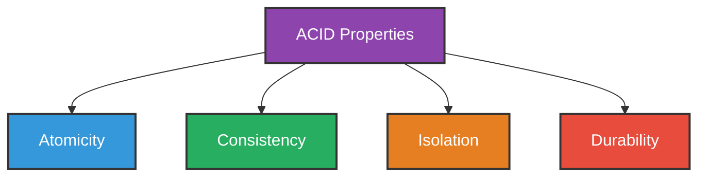
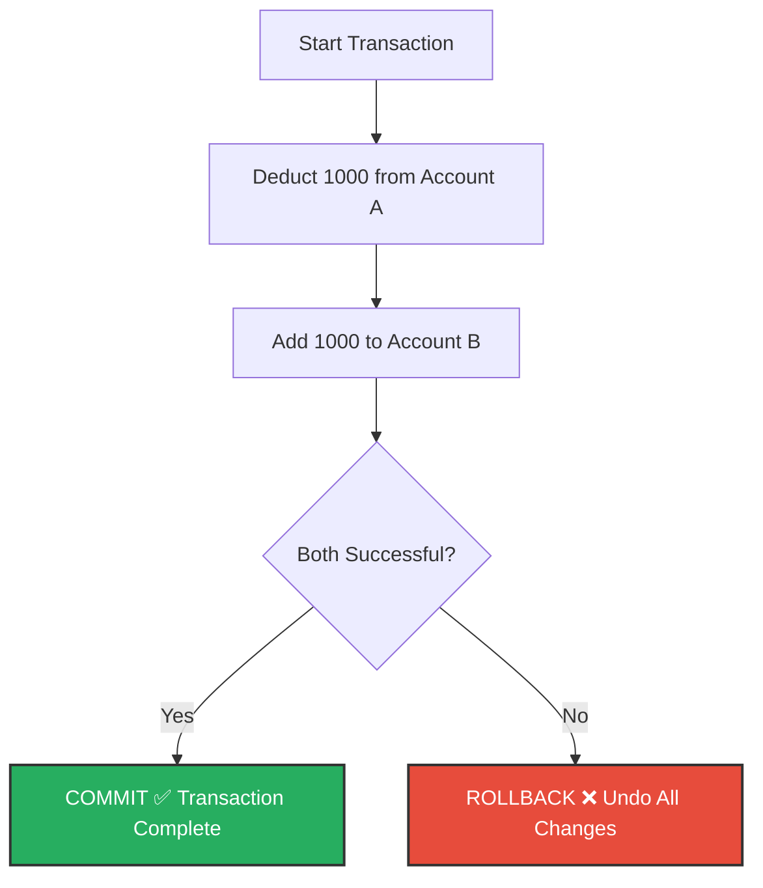
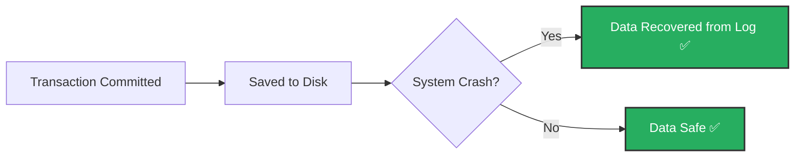
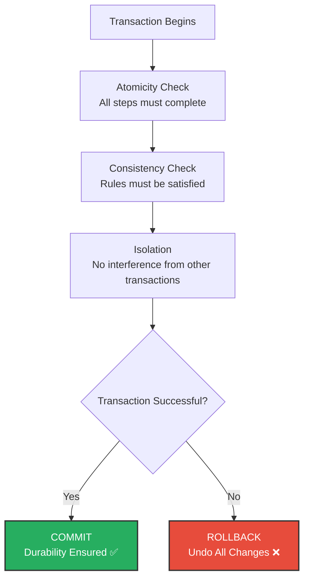

# ACID Properties of Database

## Definition

**ACID** is a set of properties that ensure database **transactions** are processed reliably and accurately.

First, let's understand what a **transaction** is.

---

## What is a Transaction?

A **transaction** is a group of operations that are executed together as a single unit.

### Example
Transferring money from Account A to Account B involves two steps:
1. Deduct 1000 from Account A
2. Add 1000 to Account B

Both steps must complete successfully. If one fails, the other must also be undone.

This group of operations is called a **transaction**.

---

## ACID stands for:

---

## 1. Atomicity

### Definition
A transaction is treated as a **single unit**.

Either **all operations** in the transaction complete successfully, or **none of them** are applied.

> All or Nothing.

### Example
Bank Transfer: Deduct from A, Add to B.

- If deduction is successful but adding fails → **Rollback** both.
- If both succeed → **Commit** the transaction.

### Key Terms
| Term | Meaning |
|------|---------|
| **COMMIT** | Save all changes permanently |
| **ROLLBACK** | Undo all changes if something fails |

---

## 2. Consistency

### Definition
A transaction must bring the database from one **valid state** to another **valid state**.

All rules, constraints, and conditions of the database must be satisfied **before and after** the transaction.

> Database must always remain in a correct and valid state.

### Example
Total money before transfer = Total money after transfer.

- Account A has 5000
- Account B has 3000
- **Total = 8000**

After transferring 1000:

- Account A has 4000
- Account B has 4000
- **Total = 8000** ✅ (still consistent)

If the total changes, the database is **inconsistent** and the transaction must be rejected.

---

## 3. Isolation

### Definition
When multiple transactions are running at the **same time**, each transaction must be **independent** of the others.

One transaction should not affect or interfere with another transaction that is still in progress.

> Each transaction runs as if it is the only transaction in the system.

### Example

Two people are booking the **last seat** on a flight at the same time.

With isolation:
- One transaction completes first.
- The other sees the updated seat as unavailable.
- Double booking is prevented.

---

## 4. Durability

### Definition
Once a transaction is **committed**, the changes are **permanent**.

Even if the system crashes, power goes out, or an error occurs after the commit, the data will not be lost.

> Committed data is saved forever.

### Example
You successfully transfer money and receive a confirmation.

Even if the server crashes right after:
- The deduction from Account A is saved.
- The addition to Account B is saved.
- No data is lost.

This is achieved using **transaction logs** stored on disk.

---

## ACID Properties — Summary Table

| Property | Meaning | Key Idea | Example |
|----------|---------|----------|---------|
| **Atomicity** | All or nothing | Either complete or rollback | Money deducted but not added → rollback |
| **Consistency** | Valid state always | Rules must be satisfied | Total money must remain same |
| **Isolation** | Independent transactions | No interference between transactions | Two users booking same seat |
| **Durability** | Permanent after commit | Data survives crashes | Confirmed transfer is never lost |

---

## Complete ACID Flow Diagram

---

## Summary

- **ACID** properties ensure that database transactions are reliable and accurate.
- **Atomicity** — All operations complete or none do.
- **Consistency** — Database always remains in a valid state.
- **Isolation** — Transactions do not interfere with each other.
- **Durability** — Committed data is permanently saved.

> ACID properties are essential for any system that handles critical data such as banking, airline reservations, and hospital management systems.