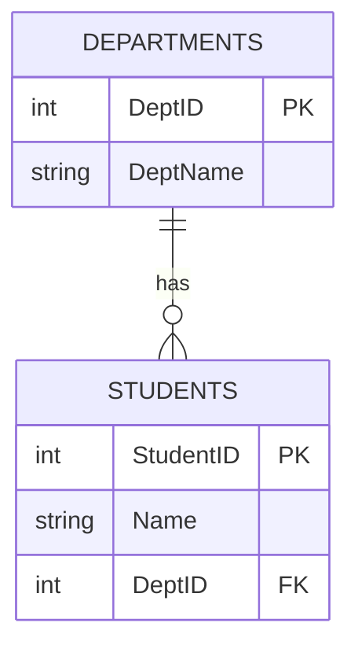
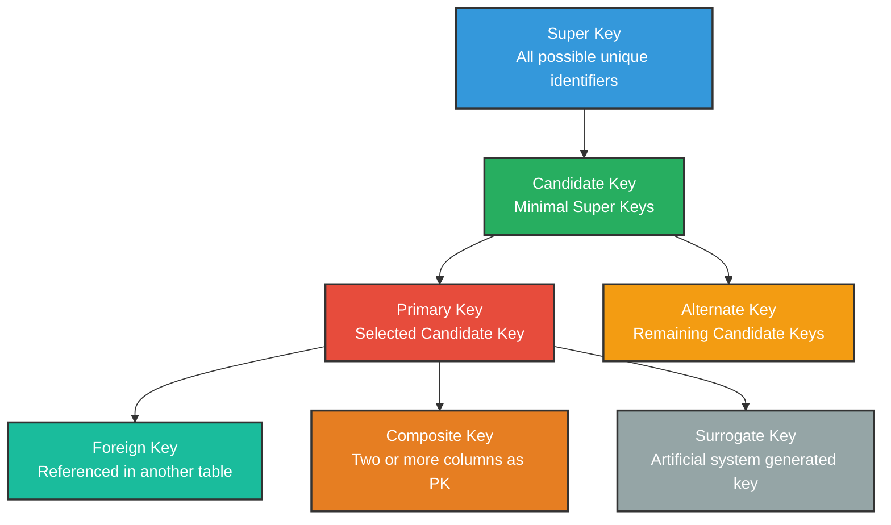

# Keys in Database

## Definition

A **Key** is a column or a set of columns in a table that is used to **uniquely identify** rows or establish **relationships** between tables.

---

## Why Keys?

- To uniquely identify each row in a table
- To avoid duplicate records
- To establish relationships between tables
- To maintain data integrity

---

## Types of Keys


---

We will use this **Student Table** for all examples:

| StudentID | Name | Email | Phone | DeptID |
|-----------|------|-------|-------|--------|
| 1 | Alice | alice@gmail.com | 01711... | 101 |
| 2 | Bob | bob@gmail.com | 01811... | 102 |
| 3 | Charlie | charlie@gmail.com | 01911... | 101 |

---

## 1. Super Key

### Definition
A **Super Key** is any column or combination of columns that can **uniquely identify** a row in a table.

It may contain **extra columns** that are not necessary for unique identification.

### Example
From the Student table, all of the following are super keys:

- StudentID
- Email
- Phone
- StudentID + Name
- StudentID + Email
- StudentID + Name + Email

> Any combination that makes a row unique is a super key.

---

## 2. Candidate Key

### Definition
A **Candidate Key** is a **minimal super key**.

It is the smallest set of columns that can uniquely identify a row. No extra columns are included.

### Example
From the Student table:

- **StudentID** → Can uniquely identify each student ✅
- **Email** → Can uniquely identify each student ✅
- **Phone** → Can uniquely identify each student ✅

These three are candidate keys.

**StudentID + Name** is NOT a candidate key because StudentID alone is enough.

> Candidate Key = Super Key without unnecessary columns.

---

## 3. Primary Key

### Definition
A **Primary Key** is the candidate key that is **selected by the database designer** to uniquely identify rows in a table.

Rules:
- Must be **unique**
- Cannot be **NULL**
- A table can have only **one** primary key

### Example
From the candidate keys (StudentID, Email, Phone), we choose **StudentID** as the primary key.

```sql
CREATE TABLE Students (
    StudentID INT PRIMARY KEY,
    Name VARCHAR(50),
    Email VARCHAR(100),
    Phone VARCHAR(15),
    DeptID INT
);
```

| **StudentID** | Name | Email | Phone | DeptID |
|-----------|------|-------|-------|--------|
| **1** | Alice | alice@gmail.com | 01711 | 101 |
| **2** | Bob | bob@gmail.com | 01811 | 102 |
| **3** | Charlie | charlie@gmail.com | 01911 | 101 |

---

## 4. Alternate Key

### Definition
The candidate keys that are **not selected** as the primary key are called **Alternate Keys**.

### Example
Candidate keys were: StudentID, Email, Phone

We selected **StudentID** as Primary Key.

So:
- **Email** → Alternate Key
- **Phone** → Alternate Key

> Alternate Key = Candidate Key − Primary Key

---

## 5. Foreign Key

### Definition
A **Foreign Key** is a column in one table that **refers to the Primary Key** of another table.

It is used to create and maintain **relationships** between two tables.

### Example
DeptID in Students table refers to DeptID in Departments table.



**Departments Table:**

| DeptID | DeptName |
|--------|----------|
| 101 | Computer Science |
| 102 | Mathematics |

**Students Table:**

| StudentID | Name | DeptID (FK) |
|-----------|------|-------------|
| 1 | Alice | 101 |
| 2 | Bob | 102 |
| 3 | Charlie | 101 |

DeptID 101 and 102 must exist in Departments table. Otherwise the record will be rejected.

---

## 6. Composite Key

### Definition
A **Composite Key** is a primary key made up of **two or more columns** together to uniquely identify a row.

Used when no single column can uniquely identify a row on its own.

### Example
An **Enrollment** table where a student can enroll in multiple courses.

| StudentID | CourseID | EnrollmentDate |
|-----------|----------|----------------|
| 1 | C01 | 2024-01-10 |
| 1 | C02 | 2024-01-11 |
| 2 | C01 | 2024-01-12 |

Here:
- StudentID alone is not unique (student 1 appears twice)
- CourseID alone is not unique (C01 appears twice)
- **StudentID + CourseID together** → Unique ✅

So **(StudentID + CourseID)** is the Composite Key.

```sql
CREATE TABLE Enrollments (
    StudentID INT,
    CourseID VARCHAR(10),
    EnrollmentDate DATE,
    PRIMARY KEY (StudentID, CourseID)
);
```

---

## 7. Surrogate Key

### Definition
A **Surrogate Key** is an **artificial key** added to the table when no natural column is suitable to be a primary key.

It has no real-world meaning. It is just a system-generated unique value.

### Example
An auto-incremented ID column added to a table.

```sql
CREATE TABLE Orders (
    OrderID INT AUTO_INCREMENT PRIMARY KEY,
    ProductName VARCHAR(50),
    Quantity INT
);
```

| OrderID | ProductName | Quantity |
|---------|-------------|----------|
| 1 | Laptop | 2 |
| 2 | Phone | 5 |
| 3 | Tablet | 1 |

OrderID has no real-world meaning. It is just used to uniquely identify each order.

---

## Relationship Between Keys



---

## Summary Table

| Key | Definition | Example |
|-----|-----------|---------|
| **Super Key** | Any combination that uniquely identifies a row | StudentID, StudentID + Name |
| **Candidate Key** | Minimal super key | StudentID, Email, Phone |
| **Primary Key** | Selected candidate key | StudentID |
| **Alternate Key** | Candidate keys not selected as PK | Email, Phone |
| **Foreign Key** | References PK of another table | DeptID in Students table |
| **Composite Key** | Two or more columns as PK | StudentID + CourseID |
| **Surrogate Key** | Artificial system generated key | Auto-incremented OrderID |