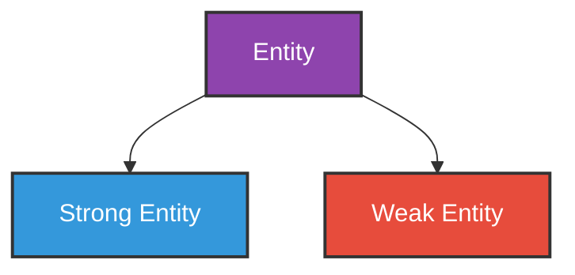
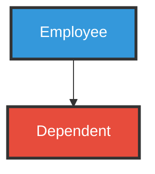
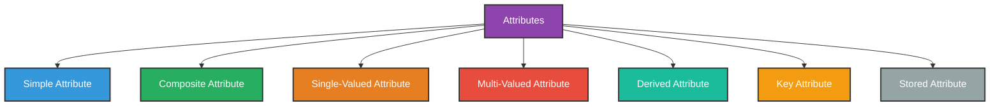
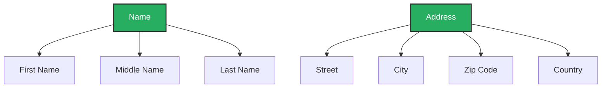
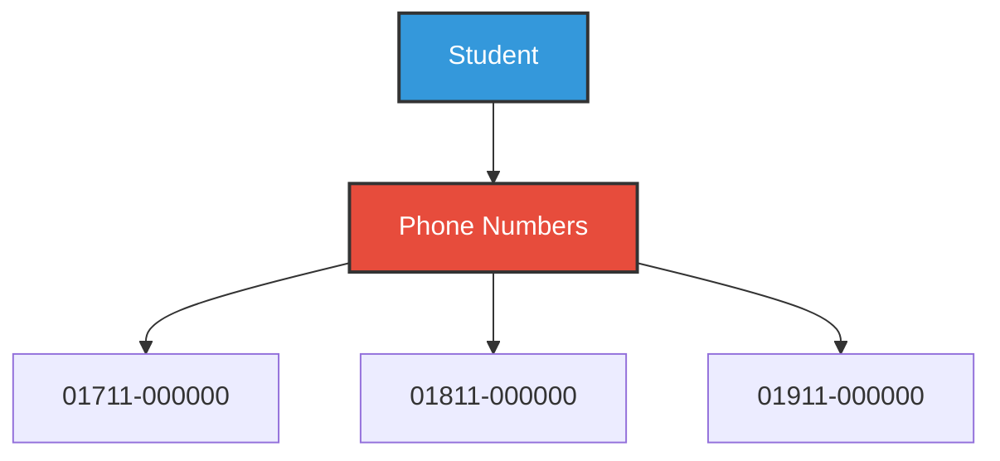
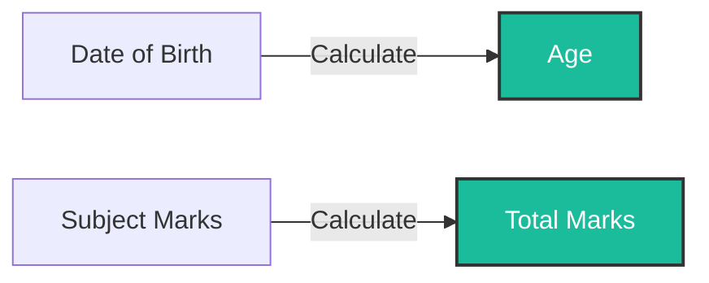
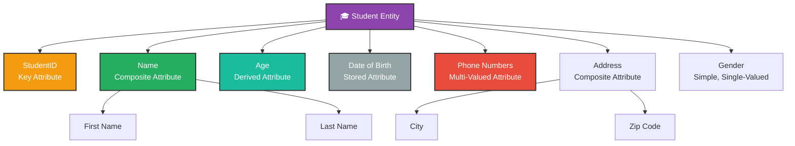

# Entities and Attributes

---

## What is an Entity?

An **Entity** is any real-world object or thing that has some data stored about it in a database.

In simple words:

> Anything about which we store information is called an entity.

### Examples

| Real World | Entity |
|-----------|--------|
| A student in a school | Student |
| A book in a library | Book |
| An employee in a company | Employee |
| A product in a shop | Product |

---

## What is an Entity Set?

A collection of similar entities is called an **Entity Set**.

### Example
All students in a school form a **Student Entity Set**.

| StudentID | Name | Age |
|-----------|------|-----|
| 1 | Alice | 20 |
| 2 | Bob | 21 |
| 3 | Charlie | 22 |

Each row is an **entity**. All rows together form an **entity set**.

---

## Types of Entities

---

### 1. Strong Entity

A **Strong Entity** is an entity that has its own **primary key** and can exist **independently** without depending on any other entity.

### Example
A **Student** entity has its own StudentID. It can exist without depending on any other entity.

> Represented by a **single rectangle** in ER diagram.

---

### 2. Weak Entity

A **Weak Entity** is an entity that **does not have its own primary key**. It depends on another entity (strong entity) for its existence.

### Example
A **Dependent** (family member) of an employee. If the employee is removed, the dependent record also has no meaning.

> Represented by a **double rectangle** in ER diagram.

| Feature | Strong Entity | Weak Entity |
|---------|--------------|-------------|
| Primary Key | Has its own | Does not have its own |
| Existence | Independent | Depends on strong entity |
| Example | Student, Employee | Dependent, Order Item |

---

## What is an Attribute?

An **Attribute** is a property or characteristic of an entity.

In simple words:

> Attributes describe what information we store about an entity.

### Example
For a **Student** entity, the attributes can be:
- StudentID
- Name
- Age
- Email
- Address

---

## Types of Attributes

---

### 1. Simple Attribute

An attribute that **cannot be divided** further into smaller parts.

### Example
- Age
- StudentID
- Salary

> Age = 21. It cannot be broken down further.

---

### 2. Composite Attribute

An attribute that **can be divided** into smaller sub-attributes.

### Example
**Name** can be divided into:
- First Name
- Middle Name
- Last Name

**Address** can be divided into:
- Street
- City
- Zip Code
- Country

| Type | Example |
|------|---------|
| Simple | Age, StudentID |
| Composite | Name → First, Middle, Last |

---

### 3. Single-Valued Attribute

An attribute that holds **only one value** for each entity.

### Example
- A student has only **one** StudentID → Single-Valued
- A person has only **one** Date of Birth → Single-Valued

---

### 4. Multi-Valued Attribute

An attribute that can hold **more than one value** for a single entity.

### Example
- A student can have **multiple** phone numbers → Multi-Valued
- A person can have **multiple** email addresses → Multi-Valued

| Type | Holds | Example |
|------|-------|---------|
| Single-Valued | One value | StudentID, Date of Birth |
| Multi-Valued | Multiple values | Phone Numbers, Email Addresses |

---

### 5. Derived Attribute

An attribute whose value can be **calculated or derived** from another attribute.

### Example
- **Age** can be derived from **Date of Birth**
- **Total Marks** can be derived from individual subject marks

> Derived attributes are not physically stored. They are calculated when needed.

---

### 6. Key Attribute

An attribute that **uniquely identifies** each entity in an entity set.

### Example
- **StudentID** uniquely identifies each student → Key Attribute
- **EmployeeID** uniquely identifies each employee → Key Attribute

> Key attribute is the **Primary Key** of the entity.

---

### 7. Stored Attribute

An attribute that is **physically stored** in the database and is used to derive other attributes.

### Example
- **Date of Birth** is stored → used to derive **Age**
- **Subject Marks** are stored → used to derive **Total Marks**

| Stored Attribute | Derived Attribute |
|-----------------|-------------------|
| Date of Birth | Age |
| Subject Marks | Total Marks |
| Price + Quantity | Total Bill |

---

## Complete Example — Student Entity with All Attribute Types

---

## Summary Table

| Attribute Type | Definition | Example |
|---------------|-----------|---------|
| **Simple** | Cannot be divided | Age, StudentID |
| **Composite** | Can be divided into sub-parts | Name → First, Last |
| **Single-Valued** | Holds only one value | Date of Birth |
| **Multi-Valued** | Holds multiple values | Phone Numbers |
| **Derived** | Calculated from another attribute | Age from Date of Birth |
| **Key** | Uniquely identifies an entity | StudentID |
| **Stored** | Physically stored, used to derive others | Date of Birth |

---

## Summary

- An **Entity** is a real-world object about which data is stored.
- A **Strong Entity** exists independently. A **Weak Entity** depends on another entity.
- **Attributes** are properties that describe an entity.
- Types of attributes:
  - **Simple** — cannot be divided
  - **Composite** — can be divided into sub-parts
  - **Single-Valued** — holds one value
  - **Multi-Valued** — holds multiple values
  - **Derived** — calculated from stored attribute
  - **Key** — uniquely identifies each entity
  - **Stored** — physically stored in the database