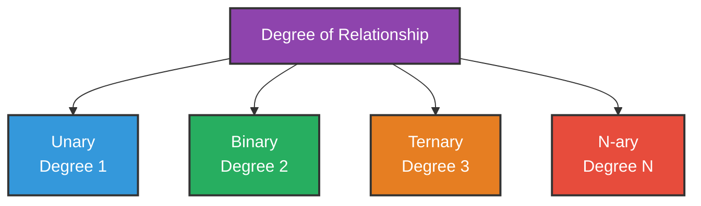
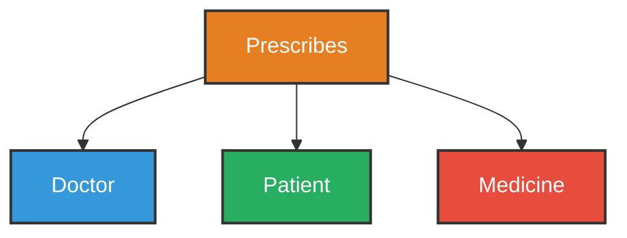
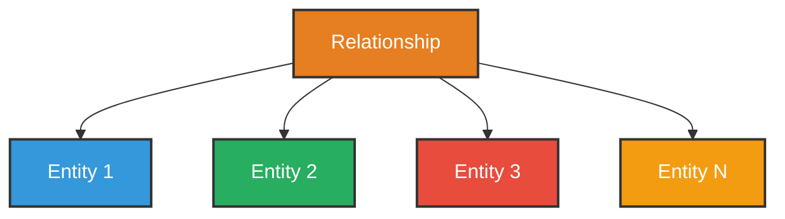
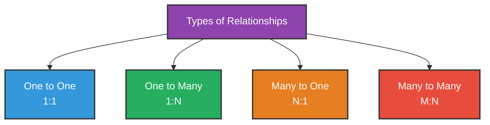
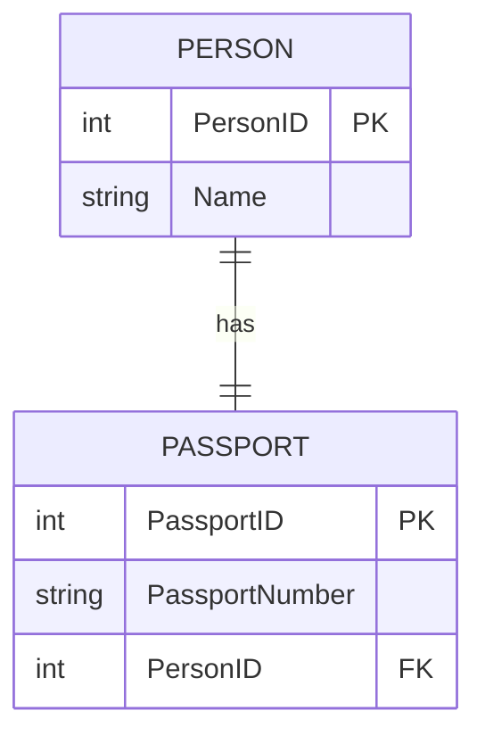
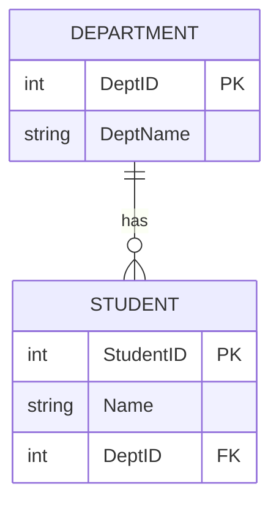
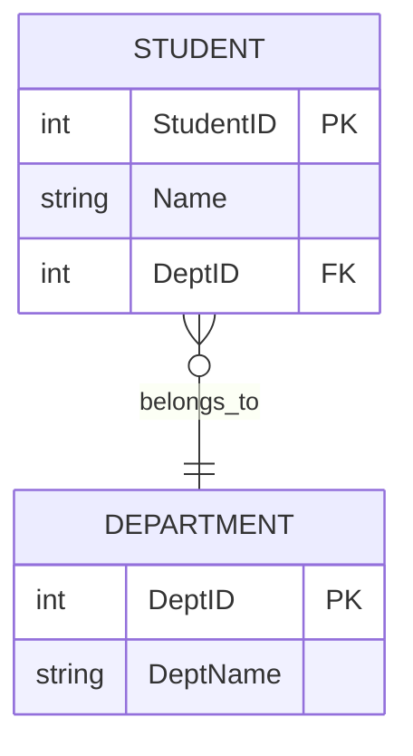
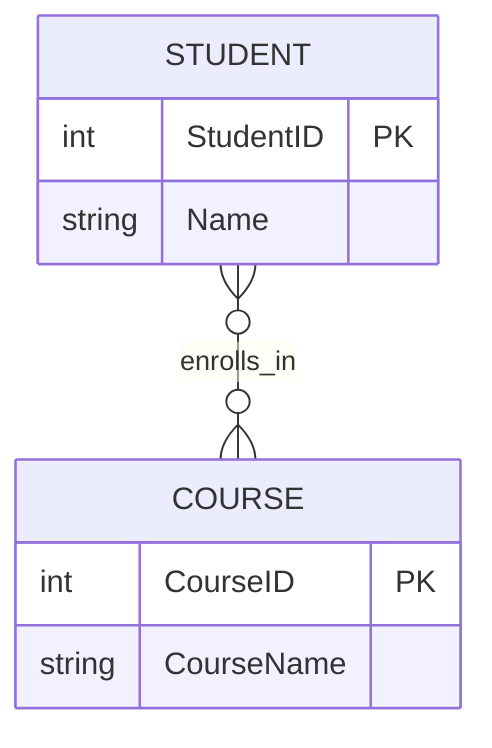
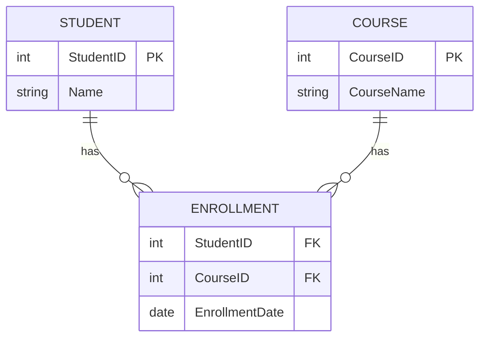

# Relationship Sets and Types of Relationships

---

## What is a Relationship?

A **Relationship** describes how two or more entities are **associated** or **connected** with each other.

### Examples

| Entity 1 | Relationship | Entity 2 |
|----------|-------------|----------|
| Student | Enrolls in | Course |
| Employee | Works in | Department |
| Customer | Places | Order |
| Doctor | Treats | Patient |

---

## What is a Relationship Set?

A **Relationship Set** is a collection of similar relationships between entities of the same entity sets.

### Example
All enrollments of all students in all courses form a **Relationship Set**.

| StudentID | CourseID | EnrollmentDate |
|-----------|----------|----------------|
| 1 | C01 | 2024-01-10 |
| 2 | C02 | 2024-01-11 |
| 3 | C01 | 2024-01-12 |

Each row is a **relationship**. All rows together form a **relationship set**.

---

## Degree of a Relationship

Degree means **how many entities** are involved in a relationship.

### 1. Unary Relationship (Degree 1)
A relationship between instances of the **same entity**.

Example: An employee **manages** another employee.

### 2. Binary Relationship (Degree 2)
A relationship between **two different entities**.

Example: A student **enrolls in** a course.

### 3. Ternary Relationship (Degree 3)
A relationship among **three entities** at the same time.

Example: A doctor **prescribes** a medicine to a patient.

### 4. N-ary Relationship (Degree N)
A relationship among **N entities** at the same time.

---

## Types of Relationships (Cardinality)

**Cardinality** defines how many instances of one entity are related to how many instances of another entity.

---

## 1. One to One (1:1)

### Definition
One instance of an entity is associated with **only one** instance of another entity.

### Example
Each person has only one passport. Each passport belongs to only one person.

### Data Example

| PersonID | Name |
|----------|------|
| 1 | Alice |
| 2 | Bob |

| PassportID | PassportNumber | PersonID |
|------------|---------------|----------|
| P01 | BD1234567 | 1 |
| P02 | BD7654321 | 2 |

> One person → One passport. One passport → One person.

---

## 2. One to Many (1:N)

### Definition
One instance of an entity is associated with **many** instances of another entity.

But each instance of the second entity is associated with only **one** instance of the first entity.

### Example
One department has many students. But each student belongs to only one department.

### Data Example

| DeptID | DeptName |
|--------|----------|
| 101 | Computer Science |
| 102 | Mathematics |

| StudentID | Name | DeptID |
|-----------|------|--------|
| 1 | Alice | 101 |
| 2 | Bob | 101 |
| 3 | Charlie | 102 |

> One department → Many students. Each student → One department.

---

## 3. Many to One (N:1)

### Definition
Many instances of an entity are associated with **one** instance of another entity.

This is just the **reverse** of One to Many.

### Example
Many students belong to one department.

> Many students → One department.

---

## 4. Many to Many (M:N)

### Definition
Many instances of one entity are associated with **many** instances of another entity.

### Example
A student can enroll in many courses. A course can have many students.

### How M:N is Handled in Database

Many to Many relationships cannot be stored directly. A **junction table** (also called bridge table) is created in between.

### Data Example

**Students:**

| StudentID | Name |
|-----------|------|
| 1 | Alice |
| 2 | Bob |

**Courses:**

| CourseID | CourseName |
|----------|------------|
| C01 | Database |
| C02 | Networking |

**Enrollment (Junction Table):**

| StudentID | CourseID | EnrollmentDate |
|-----------|----------|----------------|
| 1 | C01 | 2024-01-10 |
| 1 | C02 | 2024-01-11 |
| 2 | C01 | 2024-01-12 |

> Alice is enrolled in Database and Networking. Database has Alice and Bob.

---

## Participation Constraints

Participation defines whether all or some entities must participate in a relationship.

### Total Participation
**Every** instance of the entity must participate in the relationship.

Example: Every student **must** be enrolled in at least one course.

### Partial Participation
**Some** instances of the entity may participate in the relationship.

Example: Not every employee **must** manage a department.

| Type | Meaning | Example |
|------|---------|---------|
| **Total** | All instances must participate | Every student must enroll |
| **Partial** | Some instances may participate | Some employees manage a team |

---

## Summary Table

| Relationship Type | Meaning | Example |
|------------------|---------|---------|
| **One to One (1:1)** | One entity relates to one entity | Person and Passport |
| **One to Many (1:N)** | One entity relates to many entities | Department and Students |
| **Many to One (N:1)** | Many entities relate to one entity | Students and Department |
| **Many to Many (M:N)** | Many entities relate to many entities | Students and Courses |

---

## Summary

- A **Relationship** shows how two entities are connected.
- A **Relationship Set** is a collection of similar relationships.
- **Degree** defines how many entities are involved — Unary, Binary, Ternary.
- **Cardinality** defines the number of associations:
  - **1:1** — One to One
  - **1:N** — One to Many
  - **N:1** — Many to One
  - **M:N** — Many to Many
- **Many to Many** relationships are handled using a **junction table**.
- **Participation** can be Total or Partial.