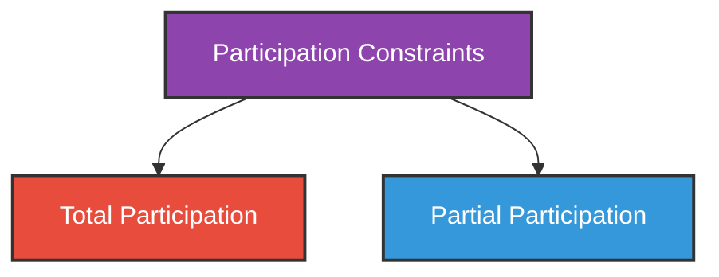
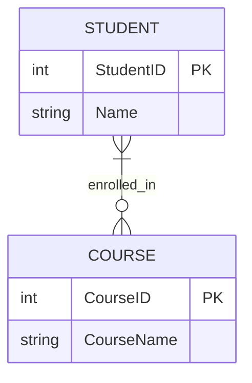
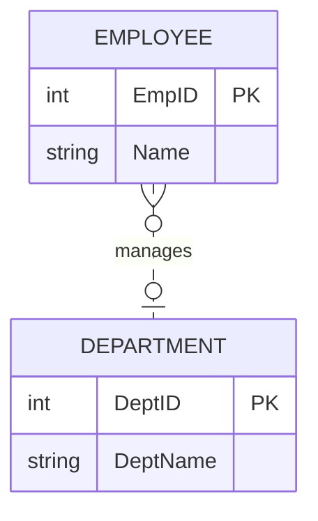
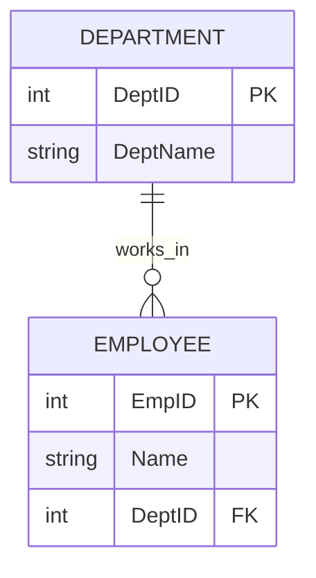

# Participation Constraints

---

## What is a Participation Constraint?

A **Participation Constraint** defines whether an entity **must** participate in a relationship or participation is **optional**.

In simple words:

> It answers the question — "Does every instance of an entity have to be part of this relationship?"

---

## Types of Participation

---

## 1. Total Participation

### Definition
**Every** instance of the entity **must** participate in the relationship.

Participation is **compulsory**. No entity instance can exist without being part of the relationship.

### Notation in ER Diagram
Shown by a **double line** between entity and relationship.

### Example
Every student **must** be enrolled in at least one course. A student cannot exist in the system without enrollment.

### Data Example

| StudentID | Name |
|-----------|------|
| 1 | Alice |
| 2 | Bob |
| 3 | Charlie |

**Rule:** All 3 students must appear in the Enrollment table. No student can be left out.

| StudentID | CourseID |
|-----------|----------|
| 1 | C01 |
| 2 | C02 |
| 3 | C01 |

> Every student participates → **Total Participation** ✅

---

## 2. Partial Participation

### Definition
**Not all** instances of the entity need to participate in the relationship.

Participation is **optional**. Some entity instances may participate, some may not.

### Notation in ER Diagram
Shown by a **single line** between entity and relationship.

### Example
Not every employee manages a department. Only some employees are managers.

### Data Example

| EmpID | Name |
|-------|------|
| 1 | Alice |
| 2 | Bob |
| 3 | Charlie |
| 4 | David |

**Manages Table:**

| EmpID | DeptID |
|-------|--------|
| 1 | D01 |
| 3 | D02 |

> Only Alice and Charlie manage departments. Bob and David do not participate → **Partial Participation** ✅

---

## Combined Example — Total and Partial Together

Consider the relationship: **Employee works in Department**

- Every employee **must** work in a department → **Total Participation** (Employee side)
- A department **may or may not** have employees → **Partial Participation** (Department side)

| Entity | Participation | Reason |
|--------|--------------|--------|
| Employee | **Total** | Every employee must belong to a department |
| Department | **Partial** | A new department may have no employees yet |

---

## How to Identify Participation? (Simple Rule)

Ask this question for each entity:

> **"Can this entity exist without being in the relationship?"**

- If **NO** → Total Participation
- If **YES** → Partial Participation

### Examples

| Question | Answer | Participation |
|----------|--------|---------------|
| Can a student exist without enrolling in a course? | No | Total |
| Can an employee exist without managing a department? | Yes | Partial |
| Can a person exist without a passport? | Yes | Partial |
| Can a passport exist without belonging to a person? | No | Total |
| Can an order exist without a customer? | No | Total |
| Can a customer exist without placing an order? | Yes | Partial |

---

## Difference Between Total and Partial Participation

| Feature | Total Participation | Partial Participation |
|---------|--------------------|-----------------------|
| Meaning | Every instance must participate | Participation is optional |
| ER Notation | Double line | Single line |
| Existence | Entity cannot exist alone | Entity can exist alone |
| Example | Every student must enroll in a course | Not every employee manages a department |

---

## Summary

- **Participation Constraint** defines whether an entity's involvement in a relationship is compulsory or optional.
- **Total Participation** — Every instance must participate. Shown by a double line.
  - Example: Every student must be enrolled in a course.
- **Partial Participation** — Participation is optional. Shown by a single line.
  - Example: Only some employees manage departments.
- Simple test: If the entity **cannot exist** without the relationship → Total. If it **can exist** without it → Partial.