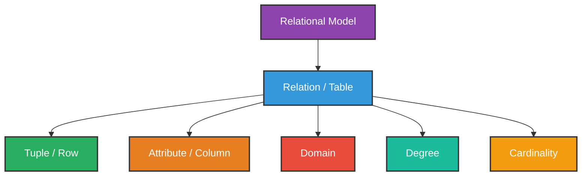
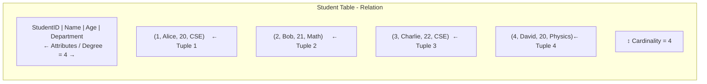
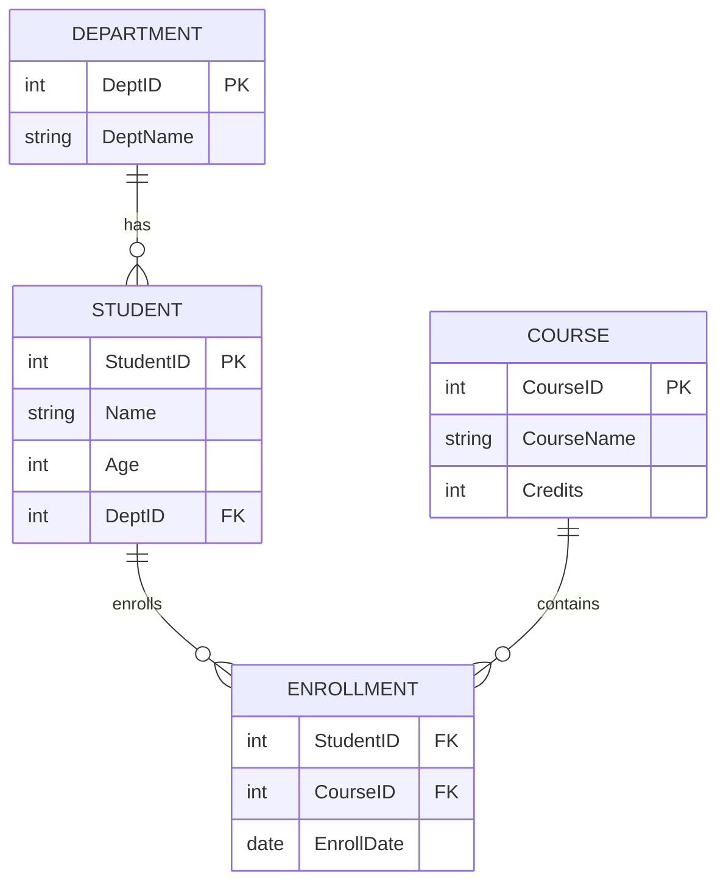

# Relational Model

---

## What is the Relational Model?

The **Relational Model** is a way of organizing and storing data in the form of **tables** (also called **relations**).

It was introduced by **E.F. Codd** in **1970**.

In this model:
- Data is stored in **tables**
- Each table has **rows** and **columns**
- Tables are related to each other using **keys**

> It is the foundation of all **RDBMS** (MySQL, PostgreSQL, Oracle, etc.)

---

## Basic Terminology



---

## Terminology Explained

Consider this **Student Table**:

| StudentID | Name | Age | Department |
|-----------|------|-----|------------|
| 1 | Alice | 20 | CSE |
| 2 | Bob | 21 | Math |
| 3 | Charlie | 22 | CSE |
| 4 | David | 20 | Physics |

---

### 1. Relation (Table)
The entire table is called a **Relation**.

> The **Student** table is a relation.

---

### 2. Tuple (Row)
Each **row** in the table is called a **Tuple**.

> (1, Alice, 20, CSE) is one tuple.

---

### 3. Attribute (Column)
Each **column** in the table is called an **Attribute**.

> StudentID, Name, Age, Department are attributes.

---

### 4. Domain
The set of **allowed values** for an attribute is called its **Domain**.

| Attribute | Domain |
|-----------|--------|
| StudentID | Positive integers |
| Name | Text (letters only) |
| Age | Integer between 15 and 60 |
| Department | CSE, Math, Physics, etc. |

---

### 5. Degree
The **number of attributes (columns)** in a table is called its **Degree**.

> Student table has 4 columns → **Degree = 4**

---

### 6. Cardinality
The **number of tuples (rows)** in a table is called its **Cardinality**.

> Student table has 4 rows → **Cardinality = 4**

---

## Visual Representation



---

## Properties of a Relation

A relation (table) in the relational model must follow these properties:

| Property | Description |
|----------|-------------|
| **Unique Name** | Each table must have a unique name |
| **Unique Attribute Names** | Each column name must be unique within the table |
| **Atomic Values** | Each cell must contain a single value (no multiple values in one cell) |
| **No Duplicate Tuples** | No two rows can be exactly identical |
| **No Order of Tuples** | Order of rows does not matter |
| **No Order of Attributes** | Order of columns does not matter |

---

## Relational Schema

A **Relational Schema** defines the structure of a relation.

### Format
```
RelationName (Attribute1, Attribute2, Attribute3, ...)
```

### Example
```
Student (StudentID, Name, Age, Department)
Course (CourseID, CourseName, Credits)
Enrollment (StudentID, CourseID, EnrollmentDate)
```

The **underlined** attribute is the Primary Key.

---

## Keys in Relational Model

| Key | Role |
|-----|------|
| **Primary Key** | Uniquely identifies each tuple |
| **Foreign Key** | Links two relations together |
| **Candidate Key** | Possible choices for primary key |

---

## Relational Model — Multiple Tables Example



---

## Advantages of Relational Model

- Simple and easy to understand (data in table format)
- Data can be easily retrieved using **SQL**
- Relationships between tables using **keys**
- Supports **ACID** properties
- Reduces **data redundancy**
- Easy to **maintain and modify**

## Disadvantages of Relational Model

- Not suitable for very **complex data** (like images, videos)
- Performance decreases with very **large datasets**
- Requires **proper design** (normalization) to avoid issues

---

## Summary Table

| Term | Meaning | Example |
|------|---------|---------|
| **Relation** | The table itself | Student Table |
| **Tuple** | A single row | (1, Alice, 20, CSE) |
| **Attribute** | A column | Name, Age |
| **Domain** | Allowed values for a column | Age: 15 to 60 |
| **Degree** | Number of columns | 4 |
| **Cardinality** | Number of rows | 4 |
| **Schema** | Structure of the relation | Student(StudentID, Name, Age) |

---

## Summary

- The **Relational Model** stores data in tables called **relations**.
- Introduced by **E.F. Codd** in 1970.
- Key terms: Relation, Tuple, Attribute, Domain, Degree, Cardinality.
- Each table must follow certain **properties** such as unique rows, atomic values, unique column names.
- Tables are connected using **Primary Keys** and **Foreign Keys**.
- It is the basis of all modern **RDBMS** systems.