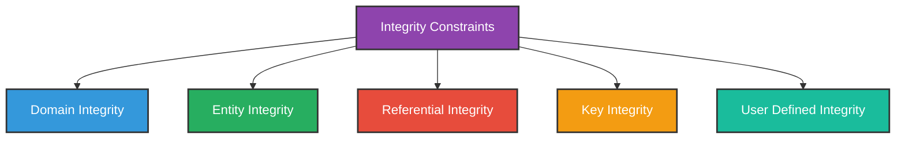
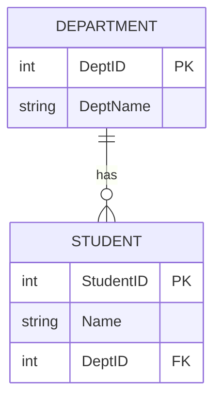
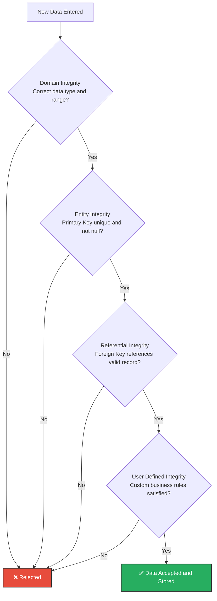

# Integrity Constraints

---

## What is Integrity Constraint?

**Integrity Constraints** are a set of **rules** applied on the database to ensure the **accuracy**, **validity**, and **consistency** of data.

In simple words:

> Integrity constraints make sure that only **correct and valid data** is stored in the database.

---

## Why Integrity Constraints?

- To prevent **invalid or incorrect data** from entering the database
- To maintain **relationships** between tables correctly
- To ensure data remains **consistent** at all times
- To protect **data quality**

---

## Types of Integrity Constraints



---

## 1. Domain Integrity

### Definition
**Domain Integrity** ensures that every value stored in a column belongs to a **defined set of valid values** (its domain).

It controls:
- **Data type** of a column (integer, text, date, etc.)
- **Range** of allowed values
- **Format** of the value

### Example
Age must be an integer and must be between 15 and 60.

```sql
CREATE TABLE Students (
    StudentID INT,
    Name VARCHAR(50),
    Age INT CHECK (Age >= 15 AND Age <= 60)
);
```

### Valid vs Invalid Data

| StudentID | Name | Age | Valid? |
|-----------|------|-----|--------|
| 1 | Alice | 20 | ✅ Valid |
| 2 | Bob | 12 | ❌ Invalid (below 15) |
| 3 | Charlie | abc | ❌ Invalid (not an integer) |

### Constraints Used
- **Data Type** — column must store correct type
- **CHECK** — value must satisfy a condition
- **NOT NULL** — value cannot be empty
- **DEFAULT** — default value if none is given

---

## 2. Entity Integrity

### Definition
**Entity Integrity** ensures that each row (tuple) in a table is **uniquely identifiable**.

### Rules
- Every table must have a **Primary Key**
- Primary Key value must be **unique**
- Primary Key value **cannot be NULL**

### Example

```sql
CREATE TABLE Students (
    StudentID INT PRIMARY KEY,
    Name VARCHAR(50),
    Age INT
);
```

| StudentID | Name | Age | Valid? |
|-----------|------|-----|--------|
| 1 | Alice | 20 | ✅ Valid |
| 2 | Bob | 21 | ✅ Valid |
| 2 | Charlie | 22 | ❌ Invalid (duplicate StudentID) |
| NULL | David | 23 | ❌ Invalid (NULL not allowed) |

> Without a primary key, rows cannot be uniquely identified → Entity Integrity is violated.

---

## 3. Referential Integrity

### Definition
**Referential Integrity** ensures that relationships between tables remain **valid and consistent**.

### Rule
A **Foreign Key** value in one table must either:
- Match an existing **Primary Key** value in the referenced table, OR
- Be **NULL** (if allowed)

A record cannot reference something that does not exist.

### Example

**Departments Table:**

| DeptID | DeptName |
|--------|----------|
| 101 | CSE |
| 102 | Math |

**Students Table:**

| StudentID | Name | DeptID (FK) | Valid? |
|-----------|------|-------------|--------|
| 1 | Alice | 101 | ✅ Valid (101 exists) |
| 2 | Bob | 102 | ✅ Valid (102 exists) |
| 3 | Charlie | 999 | ❌ Invalid (999 does not exist) |



### What Happens When Referential Integrity is Violated?

When we try to delete or update a referenced record, the database has options:

| Action | Description |
|--------|-------------|
| **RESTRICT** | Prevent the delete or update |
| **CASCADE** | Automatically delete or update related records |
| **SET NULL** | Set the foreign key to NULL |
| **SET DEFAULT** | Set the foreign key to a default value |

### Example
If Department 101 is deleted:

- **RESTRICT** → Deletion is blocked because students still reference it
- **CASCADE** → Department 101 and all its students are deleted
- **SET NULL** → Students' DeptID is set to NULL
- **SET DEFAULT** → Students' DeptID is set to a default value

---

## 4. Key Integrity

### Definition
**Key Integrity** ensures that the **key constraints** of a table are maintained properly.

### Rules
- **Primary Key** must be unique and not null
- **Candidate Keys** must also be unique
- **Foreign Keys** must reference valid primary keys

This is closely related to Entity and Referential Integrity but focuses specifically on key columns.

### Example

```sql
CREATE TABLE Students (
    StudentID INT PRIMARY KEY,       -- Key Integrity
    Email VARCHAR(100) UNIQUE,       -- Key Integrity
    Name VARCHAR(50)
);
```

| StudentID | Email | Name | Valid? |
|-----------|-------|------|--------|
| 1 | alice@gmail.com | Alice | ✅ Valid |
| 2 | bob@gmail.com | Bob | ✅ Valid |
| 3 | alice@gmail.com | Charlie | ❌ Invalid (duplicate email) |

---

## 5. User Defined Integrity

### Definition
**User Defined Integrity** refers to **custom rules** defined by the user or organization based on specific business needs.

These are rules that do not fall under the other integrity types but are important for the specific application.

### Examples

- A student's marks must be between 0 and 100.
- An employee's salary must be greater than 0.
- A product's stock cannot go below 0.
- A bank account balance cannot be negative.

```sql
CREATE TABLE Employee (
    EmpID INT PRIMARY KEY,
    Name VARCHAR(50),
    Salary DECIMAL CHECK (Salary > 0),
    Age INT CHECK (Age >= 18)
);
```

| EmpID | Name | Salary | Age | Valid? |
|-------|------|--------|-----|--------|
| 1 | Alice | 50000 | 25 | ✅ Valid |
| 2 | Bob | -1000 | 30 | ❌ Invalid (salary cannot be negative) |
| 3 | Charlie | 30000 | 16 | ❌ Invalid (age must be 18 or above) |

---

## Complete Flow — How Integrity Constraints Work



---

## Summary Table

| Constraint | Ensures | Key Rule | Example |
|------------|---------|----------|---------|
| **Domain Integrity** | Valid data type and value range | CHECK, NOT NULL, DEFAULT | Age must be between 15 and 60 |
| **Entity Integrity** | Each row is uniquely identifiable | Primary Key must be unique and not null | StudentID cannot be NULL or duplicate |
| **Referential Integrity** | Relationships between tables are valid | Foreign Key must reference existing Primary Key | DeptID must exist in Departments table |
| **Key Integrity** | Key columns maintain uniqueness | Primary and Candidate Keys must be unique | Email must be unique |
| **User Defined Integrity** | Custom business rules are followed | User defined CHECK conditions | Salary must be greater than 0 |

---

## Summary

- **Integrity Constraints** are rules that ensure data accuracy, validity, and consistency.
- There are five main types:
  - **Domain Integrity** — Correct data type and value range
  - **Entity Integrity** — Primary key must be unique and not null
  - **Referential Integrity** — Foreign key must reference a valid record
  - **Key Integrity** — All key columns must maintain uniqueness
  - **User Defined Integrity** — Custom rules based on business needs
- If any constraint is violated, the database **rejects** the data.