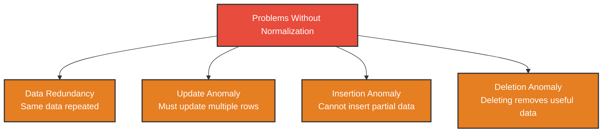
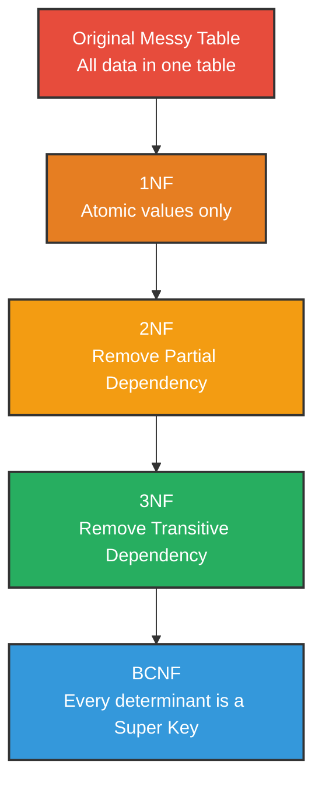

# Normalization

---

## What is Normalization?

**Normalization** is the process of organizing a database to:
- Reduce **data redundancy** (repeated data)
- Improve **data integrity**
- Make the database more **efficient**

In simple words:

> Normalization is the process of **breaking down a large, poorly designed table** into smaller, well-structured tables.

Introduced by **E.F. Codd** along with the Relational Model.

---

## Why Normalization?

Consider this table:

| StudentID | StudentName | CourseID | CourseName | Instructor | InstructorPhone |
|-----------|------------|----------|------------|------------|-----------------|
| 1 | Alice | C01 | Database | Dr. Smith | 01711 |
| 1 | Alice | C02 | Networking | Dr. Jones | 01811 |
| 2 | Bob | C01 | Database | Dr. Smith | 01711 |
| 3 | Charlie | C02 | Networking | Dr. Jones | 01811 |

### Problems in this table:

| Problem | Description | Example |
|---------|-------------|---------|
| **Data Redundancy** | Same data repeated multiple times | Dr. Smith and 01711 repeated |
| **Update Anomaly** | Updating one record requires updating many | Changing Dr. Smith's phone in multiple rows |
| **Insertion Anomaly** | Cannot add data without other data | Cannot add a course without a student |
| **Deletion Anomaly** | Deleting one record removes other useful data | Deleting Charlie removes Networking course info |

Normalization solves all these problems.

---

## Anomalies Explained



---

## Normal Forms

Normalization is done step by step through **Normal Forms**.


Each normal form has a set of rules. A table must satisfy all previous rules before moving to the next level.

---

## 1NF — First Normal Form

### Rules
- Every column must have **atomic (single) values**
- No **repeating groups** or arrays in a column
- Each column must have a **unique name**
- Each row must be **unique**

### Problem Table (Not in 1NF)

| StudentID | Name | Courses |
|-----------|------|---------|
| 1 | Alice | Database, Networking |
| 2 | Bob | Database |

**Problem:** Courses column has multiple values in one cell → Not atomic.

### After 1NF

| StudentID | Name | Course |
|-----------|------|--------|
| 1 | Alice | Database |
| 1 | Alice | Networking |
| 2 | Bob | Database |

> Each cell now has only one value → **1NF achieved** ✅

---

## Functional Dependency

Before understanding 2NF and 3NF, we need to understand **Functional Dependency**.

### Definition
If the value of attribute **A** determines the value of attribute **B**, then **B is functionally dependent on A**.

### Notation
```
A → B
(A determines B)
```

### Example

| StudentID | Name |
|-----------|------|
| 1 | Alice |
| 2 | Bob |

StudentID → Name

> Knowing StudentID, we can determine the Name.

---

## 2NF — Second Normal Form

### Rules
- Table must already be in **1NF**
- Every non-key attribute must be **fully functionally dependent** on the **entire primary key**
- No **partial dependency** allowed

### What is Partial Dependency?

When a non-key attribute depends on **only part** of the composite primary key (not the whole key).

### Problem Table (Not in 2NF)

Primary Key = **(StudentID + CourseID)**

| StudentID | CourseID | StudentName | CourseName |
|-----------|----------|-------------|------------|
| 1 | C01 | Alice | Database |
| 1 | C02 | Alice | Networking |
| 2 | C01 | Bob | Database |

**Partial Dependencies:**
- StudentName depends only on **StudentID** (not CourseID)
- CourseName depends only on **CourseID** (not StudentID)

This is **partial dependency** → Not in 2NF.

### After 2NF — Split into 3 tables

**Students Table:**

| StudentID | StudentName |
|-----------|-------------|
| 1 | Alice |
| 2 | Bob |

**Courses Table:**

| CourseID | CourseName |
|----------|------------|
| C01 | Database |
| C02 | Networking |

**Enrollment Table:**

| StudentID | CourseID |
|-----------|----------|
| 1 | C01 |
| 1 | C02 |
| 2 | C01 |

> Partial dependency removed → **2NF achieved** ✅

---

## 3NF — Third Normal Form

### Rules
- Table must already be in **2NF**
- No **transitive dependency** allowed

### What is Transitive Dependency?

When a non-key attribute depends on **another non-key attribute** (instead of the primary key directly).

```
Primary Key → Non-key A → Non-key B
```

B is transitively dependent on the Primary Key through A.

### Problem Table (Not in 3NF)

| StudentID | Name | DeptID | DeptName |
|-----------|------|--------|----------|
| 1 | Alice | 101 | CSE |
| 2 | Bob | 102 | Math |
| 3 | Charlie | 101 | CSE |

**Transitive Dependency:**

```
StudentID → DeptID → DeptName
```

DeptName depends on DeptID, not directly on StudentID.

### After 3NF — Split into 2 tables

**Students Table:**

| StudentID | Name | DeptID |
|-----------|------|--------|
| 1 | Alice | 101 |
| 2 | Bob | 102 |
| 3 | Charlie | 101 |

**Departments Table:**

| DeptID | DeptName |
|--------|----------|
| 101 | CSE |
| 102 | Math |

> Transitive dependency removed → **3NF achieved** ✅

---

## BCNF — Boyce-Codd Normal Form

### Definition
BCNF is a **stricter version** of 3NF.

### Rule
- Table must already be in **3NF**
- For every functional dependency **A → B**, A must be a **super key**

### When does 3NF fail?

3NF allows some anomalies when there are **multiple overlapping candidate keys**.

### Problem Table (in 3NF but not BCNF)

A student can have multiple teachers per subject.  
Each teacher teaches only one subject.

| StudentID | Subject | Teacher |
|-----------|---------|---------|
| 1 | Database | Dr. Smith |
| 1 | Networking | Dr. Jones |
| 2 | Database | Dr. Smith |

**Candidate Keys:** (StudentID + Subject) or (StudentID + Teacher)

**Problem:**
```
Teacher → Subject
```
Teacher is not a super key but determines Subject → BCNF violated.

### After BCNF — Split into 2 tables

**Teacher Subject Table:**

| Teacher | Subject |
|---------|---------|
| Dr. Smith | Database |
| Dr. Jones | Networking |

**Student Teacher Table:**

| StudentID | Teacher |
|-----------|---------|
| 1 | Dr. Smith |
| 1 | Dr. Jones |
| 2 | Dr. Smith |

> BCNF violation removed → **BCNF achieved** ✅

---

## Summary of Normal Forms

| Normal Form | Rule | Removes |
|------------|------|---------|
| **1NF** | Atomic values, no repeating groups | Multi-valued cells |
| **2NF** | No partial dependency | Partial dependency on composite key |
| **3NF** | No transitive dependency | Dependency between non-key attributes |
| **BCNF** | Every determinant must be a super key | Anomalies left by 3NF |

---

## Normalization Flow with Example



---

## Advantages of Normalization

- ✅ Removes data redundancy
- ✅ Eliminates update, insertion, and deletion anomalies
- ✅ Improves data consistency and integrity
- ✅ Makes the database easier to maintain

## Disadvantages of Normalization

- ❌ More tables mean more **JOIN operations** which can slow down queries
- ❌ Database design becomes more **complex**
- ❌ May reduce performance for **read-heavy** applications

---

## Summary

- **Normalization** is the process of organizing a database to reduce redundancy and improve data integrity.
- It is done through **Normal Forms** — 1NF, 2NF, 3NF, BCNF.
- **1NF** — Atomic values only.
- **2NF** — No partial dependency.
- **3NF** — No transitive dependency.
- **BCNF** — Every determinant must be a super key.
- Each level builds on the previous one and removes a specific type of problem.